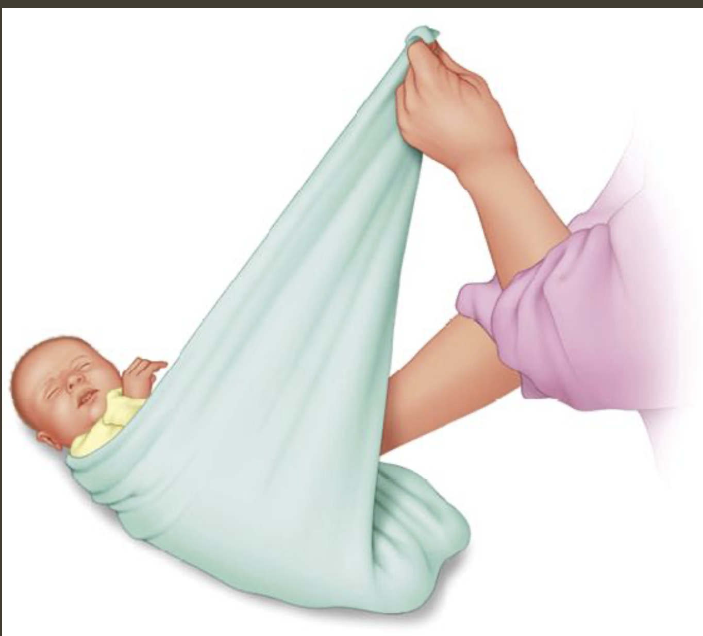

# 母乳喂养

母乳营养更加的平衡，同时母乳有许多奶粉没有的抗体。但是是否用母乳喂养应该是自己的选择，不应该被其他人指责。

对于大多数母亲来说，母乳喂养的前几周会非常累，你和新生儿都在适应一个新的现实。新生儿的喂养不只是给他提供营养，也是一个和婴儿亲近的时候。

美国儿科协会建议前6个月使用纯母乳喂养。

**母乳生产：** 孕6月的时候你的乳房已经可以产生母乳了，你可能会在这个阶段发现益乳的现象。你的产量会在产后的3-5天逐渐增加，无论你是否选择母乳喂养你都会分泌。婴儿吸允乳头会刺激大脑分泌更多催产素，从而分泌更多奶。如果不喂养的话产量会慢慢减少，喂养的次数越多产量就越多。

**母乳营养：** 通常而言母乳的营养更均衡，同时拥有多种抗体也更容易消化

**母乳对你的益处：** 母乳可以增加催产素从而使得你恢复的更快，同时抑制排卵。

## 母乳优缺点

**优点：**

- 方便，可以随时随地喂养，也可以躺着喂养
- 不需要买奶粉，成本更低
- 和小孩有更多的亲密接触
- 母乳喂养的时候可以休息下

**缺点：**

- 废妈，尤其是初生儿每2-3小时需要喂养一次。不容易休息好，就算母乳瓶喂可能也需要一个月才能有足够的产量
- 有的药不能吃、也不能喝酒
- 乳头酸痛
- 阴道干，姨妈可能需要一定时间才会规律起来
- 母乳维生素D含量可能不足，美国儿科协会建议第一年婴儿每天摄入400IU的维生素D

## 涨奶

涨奶会使得胸部变硬，变得肿痛并使得奶流速变慢，这可能会导致喂养困难。可以尝试在喂养前手动放一点奶出来，或者洗一个温水澡、使用奶泵也可以缓解涨奶。不涨之后乳晕和乳头应该是软的，可以让婴儿更好的含乳。

## 乳头酸

乳头酸痛一般来说是由不正确的喂养姿势导致的。每次喂养婴儿应该是含着整个乳晕而不姿势乳头，并且他的头应该和身体在同一条直线上。

喂养后让乳头沾点奶并且让他自然风干，或者使用羊脂膏可以护理乳头。母乳喂养后不需要清洗乳头，洗澡时只需要用清水并且让他自然风干

## 堵奶

堵奶时可以用手感觉到有小块儿，建议喂奶的时候先喂这个胸来通奶。如果长时间不处理会导致乳房感染

## 乳腺炎

乳腺炎是由细菌在乳腺内增长导致的。这些细菌对婴儿没有影响，只是他不应该存在于乳腺组织内。乳腺炎症状包括发烧、怕冷、肌肉酸痛，乳头发红、发肿，乳房肿痛。如果有乳腺炎的话建议及时就医，乳腺炎可能会需要用抗生素治疗，通常来说乳腺炎的治疗过程中还可以继续母乳喂养。

## 母乳保存

建议使用带盖子的塑料或者玻璃容器储存母乳，在使用之前应该用洗碗机清洗，或者使用热肥皂水彻底清洁。如果水质不放心的话可以通过煮的方式消毒。**储存3天内可以使用母乳保鲜袋。**母乳储存时应该用记号笔记录时间和日期并且放在冰箱的后边（最冷的地方）。每份母乳应该是单次使用量，并可以准备一些更小份的（30-60ml）。记住冷冻时体积会增大，不要过度罐装。

已经冻好的母乳可以增加同天的母乳，但是增加之前需要让新鲜母乳在冰箱内冷却降温再放一起避免已经冷冻的母乳解冻。不同日期的母乳不应该混装

### 母乳保质期

- **常温(25度以内)：** 2到8小时
- **带有冰的保温箱：**24小时，建议及时使用或者转移到冰箱或者冷冻
- **冷藏(3.89度)：** 5天内
- **冷冻(-15度)：** 2周
- **冷冻(-18度)：** 3-6月
- **冷冻(-20度)：** 1年

### 母乳解冻

冷冻母乳应该提前一天在冷藏室解冻，也可以使用温水解冻但是要避免水接触到容器口。不要常温解冻母乳会导致细菌繁殖。不要使用灶台或者微波炉解冻，会导致营养流失和加热不均匀。解冻后的奶应该24小时内使用，不要重新冷冻已解冻或者部分解冻的奶。

解冻后的由于奶脂降解味道和口感可能都会有变化，但是仍然可以安全的使用。在使用前可以轻轻搅动容易使得分离出的奶脂重新混合均匀

## 母乳瓶喂

刚出生的几周建议亲喂，亲喂可以帮助你产奶。一旦你觉得自己奶产量稳定，可以尝试偶尔给婴儿瓶喂。瓶喂可以让家人多接触下婴儿、同时母亲也可以休息下。

## 喂养建议

新生儿母乳喂养一般每天需要喂8-12次，大概每2-3小时一次。奶粉喂养大概需要喂6次，大概3-4小时一次。前两月会慢慢形成他自己的饮食规律，新生儿夜间可能需要喂多次。他的胃非常小，大概和他拳头一样大。

尽量让婴儿自己主动的吃奶，不要追着喂。有的小孩可能吃的很快，有的可能吃着吃着打个盹继续吃

# 奶粉喂养

## 奶粉喂养优缺点

奶粉喂养的主要优点是灵活，谁都可以喂。但是奶粉喂养需要更多时间去准备奶粉，并且还有额外的使用成本。

## 奶嘴选择

市面上有需要奶嘴选择，对于非早产儿而言不建议买太软的奶嘴，通常这些奶嘴是为了早产儿设计的。不同大小的奶嘴大小针对不同的年龄段：NB（新生儿）、3月、6月等等。奶嘴应该允许奶瓶在倒立的情况下美妙滴一滴奶，流速太快会容易胀气。

## 奶粉准备

奶粉应该按照厂商说明准备，注意奶瓶刻度不一定准

## 奶水储存

冰箱内48小时

# 新生娃

## 长相

新生儿和影视作品中的长相和不一样，一般刚出生的婴儿看起来比较乱，头可能有点变形、眼皮可能是肿的。大多数新生儿还有有一层白色的胎脂在身上。

### 头

头部可能有一定的变形、比如扁、长、歪都是正常的。

### 皮肤

婴儿的皮肤特别幼嫩，需要家长们的悉心护理。婴儿出生后，可能会出现一些常见的皮肤问题，家长难以分辨。

[**初生婴儿常见的皮肤问题（Common Skin Problems in Newborns）**](https://www.fhs.gov.hk/sc_chi/health_info/child/14851.html)

**[粟粒疹](https://www.mayoclinic.org/zh-hans/milia/img-20005930)：** 一般出现在鼻子和下巴上，看起来是凸起来的但是摸着基本上是平的。会自己消失

**摇篮帽：**[脂溢性皮炎](https://www.mayoclinic.org/zh-hans/diseases-conditions/seborrheic-dermatitis/symptoms-causes/syc-20352710)通常出现在头皮上，表现为黄白色或棕色的油腻鳞屑或厚皮屑。一般会自己消退

**[鮭魚肉色斑](https://wwwv.tsgh.ndmctsgh.edu.tw/unit/10006/12338)：** 通常出现在前额、眼睑、鼻子、上唇或后颈部，哭的时候可能会更明显。它们呈现淡粉红色或红色。一般几个月就会消散 

### 头发

新生儿发量因人而异

### 眼

新生儿出生时眼肿很常见，一般一两天后就好了。有的新生儿阳白可能有红斑，这是由出生时受到压迫导致毛细血管破裂导致的，不会对视力有影响一般一两周就好。

## 新生儿护理

### 眼部保护

在美国新生儿出生后会在眼上涂一点红霉素软膏防止眼部感染

### 维生素K注射

维生素K可以帮助止血，由于新生儿维生素K缺乏有的地方会给刚出生的新生儿注射一针维生素K

### 乙肝疫苗

新生儿一般刚出生后就会接种乙肝疫苗

### 血检

在美国新生儿一般在医院里会检查以下项目：

- [苯丙酮尿症](https://zh.wikipedia.org/zh-hant/苯丙酮尿症)
- [先天性甲状腺机能低下症](https://zh.wikipedia.org/zh-hant/先天性甲狀腺機能低下症)
- [先天性肾上腺增生症](https://zh.wikipedia.org/zh-hant/先天性腎上腺增生症)
- [半乳糖血症](https://zh.wikipedia.org/zh-hant/半乳糖血症)
- [鐮刀型紅血球疾病](https://zh.wikipedia.org/zh-hant/鐮刀型紅血球疾病)
- [中链酰基辅酶A 脱氢酶（*MCAD*）缺乏症](https://www.mayoclinic.org/zh-hans/diseases-conditions/mcad-deficiency/symptoms-causes/syc-20353745)
- [囊肿性纤维化](https://zh.wikipedia.org/zh-hant/囊腫性纖維化)

# 新生儿回家

## 襁褓

**注意要给腿留活动的空间**

## 新生儿的世界

### [原始反射](https://zh.wikipedia.org/zh-cn/原始反射)

### 感知

**视力：** 新生儿出生时近视，他们看的最清楚的距离是20-30厘米。新生儿喜欢在这个距离看你的脸和鲜艳的玩具。新生儿由于眼部肌肉比较弱可能会有斗鸡眼的表。在他安静的时候可以拿简单的物品缓慢的左右移动让他跟踪。

**听力：** 新生儿对声音感兴趣，他们对声音的反应一般是暂停吸允、睁大眼睛、停止乱动。他们可能会被大的声音惊吓到，也有可能会被吸尘器，洗衣机的声音给舒缓到。他们可以很快的熟悉一个声音，所以同一个声音他们可能只会做出几次回应。婴儿对家长的声音最好奇，他能把家长的声音和关爱、温暖、触摸关联到一起。建议多和婴儿聊天，你的声音会让他更安心。

**触觉：** 婴儿对触觉非常敏感，包括温度的变化

**味觉和嗅觉：**婴儿的嗅觉很灵敏，他很小的时候就知道目前的味道。一般婴儿喜欢甜一点的味道。

### [婴儿哭闹](https://zh.wikipedia.org/zh-cn/嬰兒哭鬧) [(婴儿肠绞痛、二月闹)](https://www.mayoclinic.org/zh-hans/diseases-conditions/colic/symptoms-causes/syc-20371074)

婴儿肠绞痛一般6周到达顶峰到3月结束，具体表现是持续的哭但是不饿、尿裤也不需要换。

### 婴儿哭

婴儿主要的沟通方式是哭：

- **饿：**婴儿一般一天要吃6-10次，前三个月一般需要夜间喂食
- **不舒服：**脏的尿裤、胀肚、消化不良、不舒服的温度和姿势都可能会让婴儿哭。
- **无聊、害怕、孤独：**有时候他无聊、感到害怕、孤独也会哭。这个时候可能需要你的陪伴
- **太累、过度刺激：**哭可以让他屏蔽外界刺激，也可以让他缓解压力。通常在傍晚到午夜之间。在这些时间里，无论你做什么似乎都无法安抚他或她，但之后宝宝可能会比之前更警觉，随后会睡得更深。这种烦躁的哭泣似乎可以帮助宝宝释放多余的能量。

随着婴儿的成熟，你会慢慢的学会区分他的需求。一般来说新生儿的前几个月哭的时候可以马上去安抚他，他这个时候并不会形成依赖性。如果婴儿一直哭闹不停可以参考下面的清单：

- 宝宝饿了吗？
- 宝宝需要换尿布吗？
- 宝宝需要打嗝吗？
- 宝宝太热或太冷了吗？
- 宝宝需要通过吮吸来获得安慰吗？
- 宝宝需要一些温柔的照顾吗——走动、摇晃、拥抱、抚摸、轻声说话、唱歌或哼唱？
- 宝宝需要换到一个更舒服的位置吗？有什么东西在夹住、刺痛或束缚他或她吗？
- 是不是经历了太多的兴奋或刺激？宝宝只是需要哭一会儿吗？

如果宝宝吃饱了，温度合适，尿裤也是干净的但是一直哭可以尝试下面的：

- 试着用毯子将宝宝紧紧地包裹起来。
- 轻声对宝宝说话或唱歌，面对面与宝宝互动。
- 轻轻抚摸宝宝的头，或者轻拍他的胸部或背部。
- 当你摇晃宝宝时，让他或她吮吸你的手指或奶嘴。
- 使用温和的动作，比如在怀里摇晃宝宝，或者让他或她靠在你的肩膀上走动，或者用前背带抱着他或她。
- 播放柔和的音乐。
- 将宝宝趴在你的腿上。
- 将宝宝竖直抱在你的肩膀或胸前。
- 将宝宝放在汽车座椅上，然后带他或她兜风。
- 给宝宝洗个温暖的澡，或者将一个温暖（不是热）的水瓶放在他或她的肚子上。
- 到户外去，推着婴儿车带宝宝散步。
- 降低宝宝所在区域的噪音、运动和灯光，或者尝试引入白噪音，比如吸尘器连续不断的声音，或者海浪声的录音。这可以通过屏蔽其他声音来放松并安抚宝宝。

如果这些都不好使的话，可能他只是需要一个人静一会儿，可以让他独自呆10-15分钟，每隔几分钟在远处看下宝宝。很多家长或许觉得这个很难做到，但是这是一个让婴儿自己安静下来的很好的机会。记住不是每次你都能让他乖乖的安静下来，这是他成长的一个过程。

**如果婴儿哭闹让你崩溃，请把它放在一个安全的地方并寻求帮助。无论如何请不要摇晃婴儿，这可能会导致他脑部受损**

## 养成良好的睡眠习惯

眼皮下垂、揉眼睛和烦躁是宝宝疲倦的常见迹象。很多小孩会落地醒，但是让他们独处一段时间一般会自己睡着。如果他没有生病、不饿、尿裤是干净的可以尝试让他自我安抚。如果你离开房间一会儿，宝宝可能会在短时间内停止哭泣。如果没有，试着安抚他或她，然后让宝宝再次安静下来。

新生儿的前几个月他可能会在你怀里睡着，大部分家长很喜欢这种亲密感。但是时间久了这可能会是婴儿唯一睡着的方式。当宝宝在半夜醒来时，他或她无法在没有喂奶和被抱的情况下再次入睡。为了避免这种情况，在宝宝困倦但还未完全入睡时将他或她放到床上。单宝宝能自我入睡的时候他会更快的学会半夜醒来后学会自己再次入睡。夜间稍有动静的小宝宝并不一定感到不安。婴儿在进入不同的睡眠周期时通常会哭泣或移动。父母有时会误以为宝宝醒了，进而开始不必要的喂食。相反，最好等待几分钟，看看宝宝是否会再次入睡。
