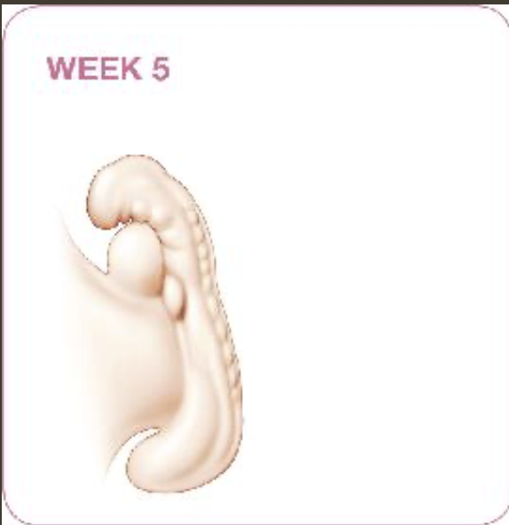
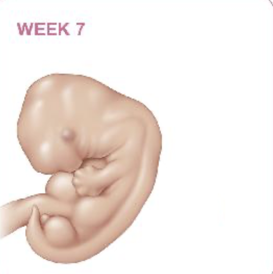
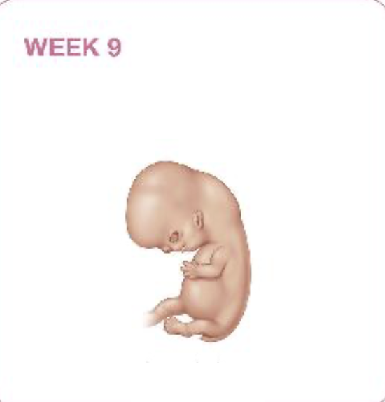
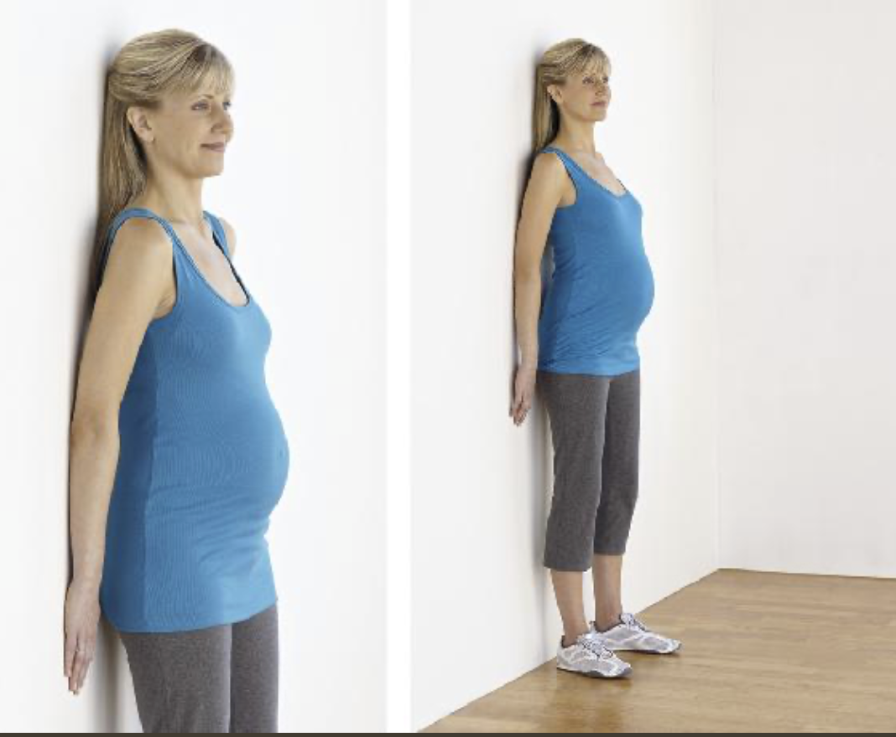

- [孕前维生素](#孕前维生素)
- [我怀孕了么？](#我怀孕了么)
- [孕父可以做的](#孕父可以做的)
  - [待产](#待产)
  - [产后](#产后)
- [孕期体重](#孕期体重)
  - [体重目标](#体重目标)
  - [增加的重量](#增加的重量)
  - [孕期运动](#孕期运动)
    - [运动员和怀孕](#运动员和怀孕)
- [孕期生病](#孕期生病)
  - [孕期一定要避免的药物](#孕期一定要避免的药物)
  - [有关草药](#有关草药)
  - [孕期常见病药物指引](#孕期常见病药物指引)
  - [感冒](#感冒)
- [孕期口腔健康](#孕期口腔健康)
- [孕期不适症状指引](#孕期不适症状指引)
  - [腹部不适](#腹部不适)
  - [腹部压力](#腹部压力)
  - [腹部压痛](#腹部压痛)
  - [痘痘](#痘痘)
  - [过敏](#过敏)
  - [胎儿打嗝](#胎儿打嗝)
  - [腰酸背疼](#腰酸背疼)
  - [视觉模糊](#视觉模糊)
  - [乳头溢液](#乳头溢液)
  - [乳房增大](#乳房增大)
  - [乳房胀痛](#乳房胀痛)
  - [臀部和腿疼](#臀部和腿疼)
  - [腕管综合征](#腕管综合征)
  - [笨拙](#笨拙)
  - [便秘](#便秘)
  - [宫缩](#宫缩)
  - [头晕](#头晕)
  - [静脉扩张](#静脉扩张)
  - [眼部变化](#眼部变化)
  - [脸部皮肤变黑](#脸部皮肤变黑)
  - [发热](#发热)
  - [羊水破裂](#羊水破裂)
  - [牙龈炎和出血](#牙龈炎和出血)
  - [头疼](#头疼)
  - [烧心](#烧心)
  - [胯部痛](#胯部痛)
  - [皮肤痒](#皮肤痒)
  - [会阴疼](#会阴疼)
  - [骨盆腔痛](#骨盆腔痛)
  - [肋骨酸痛](#肋骨酸痛)
  - [妊娠纹](#妊娠纹)
- [孕期如何提东西](#孕期如何提东西)
- [孕期旅行](#孕期旅行)
  - [出行建议](#出行建议)
    - [有关飞行](#有关飞行)
    - [有关航海](#有关航海)
    - [有关乘车出行](#有关乘车出行)
  - [出行饮食](#出行饮食)
    - [飞机上](#飞机上)
    - [车上](#车上)
    - [火车上](#火车上)
    - [邮轮](#邮轮)
    - [目的地](#目的地)
- [孕期疫苗](#孕期疫苗)
  - [流感疫苗](#流感疫苗)
  - [百白破](#百白破)
- [孕期染发](#孕期染发)
- [孕期泡澡桑拿](#孕期泡澡桑拿)
- [孕期辐射](#孕期辐射)
- [孕期防蚊](#孕期防蚊)
- [家用清洁剂](#家用清洁剂)
- [油漆](#油漆)
- [弓形虫](#弓形虫)
- [饮食](#饮食)
  - [微量元素](#微量元素)
    - [维生素](#维生素)
    - [矿物质](#矿物质)
    - [除了维生素和矿物质](#除了维生素和矿物质)
      - [膳食纤维](#膳食纤维)
      - [Omega-3](#omega-3)
      - [植物营养素](#植物营养素)
      - [益生菌](#益生菌)
  - [孕期饮食](#孕期饮食)
      - [碳水](#碳水)
    - [每日推荐摄入](#每日推荐摄入)
      - [蛋白质](#蛋白质)
        - [奶、肉](#奶肉)
        - [豆类（每份为0.5份蛋白质）](#豆类每份为05份蛋白质)
        - [谷类（每份为0.5份蛋白质）](#谷类每份为05份蛋白质)
        - [坚果和种子（每分为0.5份蛋白质）](#坚果和种子每分为05份蛋白质)
      - [钙](#钙)
      - [维生素C](#维生素c)
      - [维生素A](#维生素a)
      - [其他瓜果](#其他瓜果)
      - [谷物和豆类](#谷物和豆类)
      - [油脂](#油脂)
    - [孕期需要注意的食物](#孕期需要注意的食物)
      - [咖啡因](#咖啡因)
    - [花草茶](#花草茶)
    - [绿茶](#绿茶)
    - [鱼](#鱼)
    - [代糖](#代糖)
    - [关于一些*超级食物*](#关于一些超级食物)
    - [孕期应该避免的](#孕期应该避免的)
      - [有关李斯特菌](#有关李斯特菌)
  - [关于饮食习惯](#关于饮食习惯)
    - [晨吐](#晨吐)
    - [口腔金属味道](#口腔金属味道)
    - [食物渴望](#食物渴望)
    - [食物厌恶](#食物厌恶)
    - [便秘](#便秘-1)
    - [胀气](#胀气)
    - [胃灼热、烧心](#胃灼热烧心)
    - [疲乏](#疲乏)
    - [一些其他的症状](#一些其他的症状)
      - [牙齿牙龈](#牙齿牙龈)
      - [眩晕](#眩晕)
      - [抽筋](#抽筋)
      - [水肿](#水肿)
      - [头痛](#头痛)
      - [情绪波动](#情绪波动)
      - [皮肤和头发问题](#皮肤和头发问题)
  - [随处随地吃好](#随处随地吃好)
    - [上学或者工作](#上学或者工作)
  - [推荐的零食](#推荐的零食)
- [孕期性生活](#孕期性生活)
- [产后性生活](#产后性生活)
- [十月怀胎](#十月怀胎)
  - [阴道出血、点滴出血或分泌物](#阴道出血点滴出血或分泌物)
  - [疼痛](#疼痛)
  - [呕吐](#呕吐)
  - [其他](#其他)
  - [第1月：1-4周](#第1月1-4周)
    - [第1、2周](#第12周)
    - [第3、4周](#第34周)
    - [推荐运动](#推荐运动)
  - [第2月：5-8周](#第2月5-8周)
    - [第5周](#第5周)
    - [第6周](#第6周)
    - [第7周](#第7周)
    - [第8周](#第8周)
    - [推荐运动](#推荐运动-1)
  - [第3月：9-12周](#第3月9-12周)
    - [第9周](#第9周)
    - [第10周](#第10周)
    - [第11周](#第11周)
    - [第12周](#第12周-1)
    - [推荐运动](#推荐运动-2)
  - [第4月：13-16周](#第4月13-16周)
    - [第13周](#第13周)
    - [第14周](#第14周)
    - [第15周](#第15周)
    - [第16周](#第16周)
    - [推荐运动](#推荐运动-3)
  - [第5月：17-20周](#第5月17-20周)
    - [第17周](#第17周)
    - [第18周](#第18周)
    - [第19周](#第19周)
    - [第20周](#第20周)
    - [推荐运动](#推荐运动-4)
  - [第6月：21-24周](#第6月21-24周)
    - [第21周](#第21周)
    - [第22周](#第22周)
    - [第23周](#第23周)
    - [第24周](#第24周)
    - [推荐运动](#推荐运动-5)
  - [第7月：25-28周](#第7月25-28周)
    - [第25周](#第25周)
    - [第26周](#第26周)
    - [第27周](#第27周)
    - [第28周](#第28周)
    - [推荐运动](#推荐运动-6)
  - [第8月：29-32周](#第8月29-32周)
    - [第29周](#第29周)
    - [第30周](#第30周)
    - [第31周](#第31周)
    - [第32周](#第32周)
    - [推荐运动](#推荐运动-7)
  - [第9月：33-36周](#第9月33-36周)
    - [第33周](#第33周)
    - [第34周](#第34周-1)
    - [第35周](#第35周)
    - [第36周](#第36周)
    - [推荐运动](#推荐运动-8)
  - [第10月：37-40周](#第10月37-40周)
    - [第37周](#第37周)
    - [第38周](#第38周)
    - [第39周](#第39周)
    - [第40周](#第40周)
- [睡姿](#睡姿)
- [胎动](#胎动)
  - [胎动减少](#胎动减少)
    - [胎动减少自诊](#胎动减少自诊)
    - [什么时候告知医生](#什么时候告知医生)
- [分娩](#分娩)
  - [调整身体准备分娩](#调整身体准备分娩)
    - [运动](#运动)
  - [真分娩还是假分娩？](#真分娩还是假分娩)
  - [分娩姿势](#分娩姿势)
  - [刨腹产](#刨腹产)
    - [恢复](#恢复)
    - [潜在并发症](#潜在并发症)
- [基因筛查](#基因筛查)
- [脐带血库](#脐带血库)
- [母乳还是配方奶喂养](#母乳还是配方奶喂养)

# 孕前维生素

准备怀孕前3个月应该开始摄入产前维生素，因为你永远不知道什么时候自己怀上了，胎儿的神经管第一个月就开始发育（后期会成为大脑和脊髓）。孕前可以开始服用下面几种，尤其是以下几种

- 叶酸：有助于神经管的发育
- 钙：骨骼发育
- 铁：血细胞和肌肉的形成

怀孕前开始吃可以缓解孕吐

# 我怀孕了么？

例假没来是最明显的一个指示，但是对于经期不准的这一条就显得不是特别有用了。以下是一些常见的早孕现象：

- **胸部发胀、敏感：** 受精两周就有可能会感受到胸部发胀，并且敏感
- **乳晕增大：** 由于血液循环的增加和色素细胞的增大，乳晕可能会增加（可能是永久性的），并且还会有一些小的脂肪体凸起开始出现。这些凸起会分泌润滑和抗菌的物质
- **疲劳：** 孕早期增加的黄体激素容易让人更容易疲劳
- **轻微出血或痉挛：** 受精10-14天左右可能会出现由着床导致的少量出血。这种类型的出血通常比正常月经要早一些、颜色较浅且量较少，持续时间也较短。有些女性在怀孕初期还会经历类似于月经痉挛的腹部痉挛。
- **恶心（伴或不伴呕吐）：** 晨吐可以在一天中的任何时间发生。对于一些女性来说，恶心感非常早就开始了——在受孕后两到三周。孕妇的嗅觉也会更加敏感，因此各种气味——如烹饪食物、香水或香烟烟雾——可能会在怀孕早期引起恶心。
- **排尿增多：** 怀孕早期由于血容量的增加，更多液体通过肾脏到达膀胱
- **对食物的厌恶或渴望：** 你可能会发现自己对某些食物失去兴趣，也可能会特别想吃一些食物
- **头痛和头晕：** 随着血管扩张和血压下降，你可能会感到头晕或眩晕。

# 孕父可以做的

- 多陪伴多交流
- 提供支持，可以配孕妇一起健康饮食健康生活
- 尽量满足孕妇的要求
- 多准备一下小的餐食防止孕妇过度饥饿（会增加孕吐反应）
- 让孕妇多休息，尽量摄入更多的蛋白质和铁
- 孕中期后孕妇各类反应会减少，可以考虑带她一起出去放松下
- 多去了解孕产，知道产期的症状。
- 了解去医院的路线和停车情况，做好天气不好或者塞车的plan b
- 准备好婴儿座椅，产后婴儿应该坐婴儿座椅上
- 准备好[分娩计划](https://www.ukchinesekids.co.uk/post/分娩计划-birth-plan)
- 准备好行李，可以准备好孕妇喜欢的洗漱用品，一套新的睡衣。如果自己要过夜陪同的话，也准备好自己的行李，方便随时拿着行李就出门，不需要出门前在收拾东西

## 待产

- 在分娩的第一阶段帮助分散你伴侣的注意力。谈谈你的一天，或者一起看电影。
- 除非她被要求卧床休息，否则陪伴她一起短暂散步。
- 记录她的宫缩时间。
- 宫缩间歇期间，帮她按摩背部和肩膀。
- 帮助她进行放松技巧。
- 在她用力阶段给予支持。

最重要的是尽可能陪着她

## 产后

产后可以协助协调家属和朋友的探亲时间、帮助喂奶洗澡。孕妇可以正常饮食之后可以给她带一些她最喜欢的食物。

有娃之后很多注意力都会到新生儿上，作为父亲你还需要注意产妇的心情，并且让她知道她不会因此而被冷漠

# 孕期体重

## 体重目标

| 孕前体重                  | 推荐增加的体重（公斤） |
| ------------------------- | ---------------------- |
| 体重过轻（BMI < 18.5）    | 12.7 - 18.14           |
| 健康体重（BMI 18.5-24.9） | 11.34 - 15.88          |
| 超重 （BMI 25-29.9）      | 6.8 - 11.34            |
| 肥胖 （BMI > 30）         | 5 - 9                  |

## 增加的重量

孕期增加的重量都到哪里了呢

| 目标           | 重量（公斤） |
| -------------- | ------------ |
| 婴儿           | 3.18 - 3.63  |
| 脂肪           | 2.72 - 3.63  |
| 增加的血容量   | 1.36 - 1.81  |
| 增大的胸       | 0.45 - 1.36  |
| 身体额外的液体 | 0.91 - 1.36  |
| 更大的子宫     | 0.91         |
| 胎盘           | 0.68         |
| 羊水           | 0.91         |

## 孕期运动

每天至少运动30分钟

- 走路
- 游泳
- 划船
- 越野滑雪
- 普拉提
- 瑜伽（但是要避免高温瑜伽）
- 力量训练—在医生的同意下可以做力量训练

运动前后记得喝水拉伸，同时如果有以下症状建议运动前咨询医生：

- 严重贫血
- 多胎妊娠
- 心脏或肺部疾病
- 子痫前期
- 前置胎盘
- 阴道出血
- 早期破水
- 宫颈问题
- 糖尿病控制不良
- 高血压

运动中时记得听自己身体信号，如果有晕、恶心、视觉模糊、疲乏、穿不上气或者其他的中暑表现需要及时停止运动。如果遇到胸痛、腹部痛、宫缩、阴道出血、出液体需要马上停止并咨询医生。

### 运动员和怀孕

如果你平时经常慢跑、跑步或者游泳，在医生的同意下你可以在孕期大多数时候继续这些运动。

> “研究表明，女性进行低到中等强度的运动时，关于过热的担忧基本上是没有根据的。剧烈运动引起的早产和对胎儿血流减少的担忧也没有被证实。最近的研究表明，对于许多已经经常运动且怀孕风险较低的女性来说，即使是高强度活动通常也是安全的。所以继续保持运动吧！只要注意任何过度劳累的迹象即可。”
>
> <cite>Mayo Clinic Guide to a Healthy Pregnancy: 2nd Edition: Fully Revised and Updated</cite>

避免有高跌倒风险的运动、比如体操、骑马、下坡滑雪、滑水等，避免接触性运动比如篮球，足球。避免需要突然更改方向的运动。避免潜水和高海拔运动（避免高原反应）

# 孕期生病

孕期尽量不使用药物，只有少数药物被证孕期使用完全无影响，还有很多药物被证实好处大于任何微小或者未被证实的风险。最好在医生的指引下使用药物。如果你有长期服用的药物，例如哮喘、甲状腺功能衰减、高血压、抑郁症，请不要在和医生沟通前停止或者更改用药。

除非经过医生批准，请避免使用中草药。中草药不像处方和非处方药经过FDA批准，并可能没有经过临床实验。

## 孕期一定要避免的药物

有的药物被证实对胎儿有很大的伤害，例如：

- [异维A酸](https://zh.wikipedia.org/zh-hans/異維A酸)
- [沙利度胺](https://zh.wikipedia.org/zh-hans/沙利度胺)
- 一些血压药物（[血管紧张素转换酶抑制剂](https://zh.wikipedia.org/zh-hans/血管紧张素转换酶抑制剂)、[血管紧张素II受体拮抗剂](https://zh.wikipedia.org/zh-hans/血管紧张素II受体拮抗剂)、 [腎素抑制劑](https://www.cochranelibrary.com/cdsr/doi/10.1002/14651858.CD007066.pub3/full/zh_HANT)）

如果在使用这些药物请在停药前避免怀孕。你的医生会告诉你停药多久后可以怀孕。
## 有关草药

由于大多数草药没有经过大量的医学研究，或者副作用不明。不建议使用草药。比如用于治疗认妊娠纹的扁桃仁油和早产有一定关联性。

## 孕期常见病药物指引

| 症使用状                                                     | 普遍安全药物                                                 | 谨慎使用的药物                                               | 避免使用                                                  |
| ------------------------------------------------------------ | ------------------------------------------------------------ | ------------------------------------------------------------ | --------------------------------------------------------- |
| 感冒                                                         | 鼻腔喷雾 [氯苯那敏](https://zh.wikipedia.org/zh/氯苯那敏#:~:text=氯苯那敏（Chlorpheniramine,組胺劑之一。) [对乙酰氨基酚](https://zh.wikipedia.org/zh-hans/对乙酰氨基酚) (泰诺) [盐酸西替利嗪](https://zh.wikipedia.org/zh-hans/盐酸西替利嗪) [非索非那定](https://zh.wikipedia.org/zh-hans/非索非那定) [氯雷他定](https://zh.wikipedia.org/zh-hans/氯雷他定) (开瑞坦) | [伪麻黄碱](https://zh.wikipedia.org/zh-hans/伪麻黄碱)（尤其是孕早期） [右美沙芬](https://zh.wikipedia.org/zh-hans/右美沙芬#:~:text=右美沙芬（Dextromethorphan），,hydrobromide）常用于药品中。&text=美国食品及药物管理,作为镇咳药发售。)  | [苯肾上腺素](https://zh.wikipedia.org/zh/苯福林)          |
| 便秘                                                         | [洋车前子壳粉](https://baike.baidu.com/item/洋车前子壳粉/10917989)（纤维补充） 甘油栓剂 | [通利妥](https://zh.wikipedia.org/zh-hant/通利妥)（[多库酯钠](https://baike.baidu.com/item/多库酯钠/1189588)） [比沙可啶](https://zh.wikipedia.org/zh-cn/比沙可啶)（便塞停、乐可舒、变爽、通秘） [番泻](https://zh.wikipedia.org/zh-hans/番瀉苷) | 矿物油                                                    |
| 烧心                                                         | [抗酸药](https://zh.wikipedia.org/zh-hans/抗酸药) [法莫替丁](https://zh.wikipedia.org/zh-hans/法莫替丁#:~:text=法莫替丁（INN,相互作用并不明显。)  [雷尼替丁](https://zh.wikipedia.org/zh/雷尼替丁) [西咪替丁](https://zh.wikipedia.org/zh-hans/西咪替丁) |                                                              | 包含铝或者阿斯匹林的药物                                  |
| 腹泻                                                         |                                                              | [洛哌丁胺](https://zh.wikipedia.org/zh-hans/洛哌丁胺)（中期后期短期使用，早期避免） | [次水杨酸铋](https://zh.wikipedia.org/zh-hans/次水杨酸铋) |
| 痔疮                                                         | [洋车前子壳粉](https://baike.baidu.com/item/洋车前子壳粉/10917989)（纤维补充） |                                                              |                                                           |
| 发烧疼痛                                                     | [对乙酰氨基酚](https://zh.wikipedia.org/zh-hans/对乙酰氨基酚) (泰诺) | 布洛芬（仅限前、中期，禁止使用超过48小时） [萘普生](https://zh.wikipedia.org/zh-hans/萘普生)（仅限前、中期，禁止使用超过48小时） | 阿斯匹林（除非医生开处方）                                |
| [酵母菌感染(阴道)](https://www.mayoclinic.org/zh-hans/diseases-conditions/yeast-infection/symptoms-causes/syc-20378999) | [克霉唑](https://zh.wikipedia.org/zh-hans/克催瑪汝)          | [咪康唑](https://zh.wikipedia.org/zh-hans/咪康唑) [氟康唑](https://wuu.wikipedia.org/wiki/氟康唑) |                                                           |

## 感冒

- 多喝液体
- 多休息
- 维持房间温度和湿度
- 温盐水漱口或者蜂蜜柠檬水可以缓解喉咙不适
- 生理盐水通鼻喷剂
- 发烧和身体痛用[对乙酰氨基酚](https://zh.wikipedia.org/zh-hans/对乙酰氨基酚)

# 孕期口腔健康

孕期口腔会比平时更脆弱

- 牙齿腐蚀：孕期口腔酸度增加会增加牙齿腐蚀的风险、孕吐也会使牙齿接触到更多胃酸
- 牙松动：黄体素和雌激素的增加可能会影响到支撑牙齿的韧带和骨头导致牙齿有松动
- 牙龈：孕期容易牙龈发炎

# 孕期不适症状指引

## 腹部不适

孕早期孕中期子宫膨胀、韧带拉伸可能会带来腹部单侧或两侧的刺痛、抽筋或者拉扯感。

**预防和自治：** 躺下或者坐下可能会缓解，也可以做一些放松运动或者泡温水澡。

**何时就医：** 严重疼痛并且一直不缓解的时候。一直不缓解可能是宫外孕、孕后期可能是早产或者[胎盘脱落](todo)。

孕中期之后如果遇到腹部痛伴随下背痛并有如下症状请马上就医：

- 疼痛不消散或伴随发烧
- 阴道出血、阴道分泌物，尿道烧热疼感，肠胃不适，眩晕感
- 有宫缩感

## 腹部压力

如果没有其他并发症的话一般没有什么事。孕早期腹部压力很常见，大概率是你开始感受到子宫膨胀了。孕中期孕后期压力来自于胎儿的体重

**何时就医：** 压力伴随疼痛、抽筋、出血。如果压迫感持续4-6小时并伴随如下症状：

- 疼痛
- 阴道出血
- 隐隐的下背痛
- 宫缩
- 很稀的阴道分泌物

## 腹部压痛

怀孕期间子宫增长会拉伸腹部肌肉，这可能会导致腹直肌分离。对于大多数孕妇来说腹直肌分离是无感的，有的人会感受到肚脐附近有压痛感。一般在孕早期孕中期开始，孕后期更明显。改正轧辊一般在分娩之后就消失。

腹直肌分离不需要治疗，你的医生可能会告知你孕后如何更好的康复。

## 痘痘

孕激素会使得皮肤分泌更多油脂，你可能会在孕期出痘痘

**预防和自治：**  一般痘痘可以减轻或者预防：

- **和正常一样洗脸：** 避免使用磨砂洗面奶、收敛剂和清洁面膜。
- **避免使用油性化妆品或造型产品：** 使用水基或非致痘性的产品可以减少毛孔被堵塞的可能性。
- **注意脸部卫生：** 保持头发干净，不要让他接触你的脸。避免用手或者物品接触脸

**药物：** 

- 红霉素去痘
- [壬二酸(杜鹃花酸)](https://zh.wikipedia.org/zh-hans/壬二酸#:~:text=壬二酸（又称,大麦等榖物中。)

应该避免以下的药物：

- [阿达帕林](https://zh.wikipedia.org/zh-hans/阿达帕林#:~:text=阿达帕林（Adapalene）是,用药）和其他皮肤症状。)
- [他扎罗汀](https://zh.wikipedia.org/wiki/他扎罗汀#:~:text=他扎罗汀（INN,的光老化和光损伤。)
- [异维A酸](https://zh.wikipedia.org/zh-hans/異維A酸)

## 过敏

- 尝试[色甘酸钠](https://baike.baidu.com/item/色甘酸钠滴眼液/4312165)
- 洗鼻腔
- 吸入蒸气
- 按摩鼻窦

## 胎儿打嗝

孕期中后期你可能会感受到腹部偶尔有小抽搐，这可能是胚胎在打嗝

## 腰酸背疼

怀孕期间，为了让宝宝顺利通过骨盆，骨盆区域的关节和韧带开始软化和松弛。随着子宫的增大，腹部器官位置发生变化，体重重新分布，改变了你的‘重心’。为了应对这些变化，你会调整姿势和运动方式。这些代偿动作往往导致背痛和腰酸。

**预防和自治：** 

- 保持良好的姿势。收紧臀部，肩膀向后向下放松，保持站立挺拔。注意你站立、坐下和移动时的姿势。
- 多换姿势，避免长期站着
- 避免搬运重物，正确搬重物参考[孕期如果提东西](#孕期如何提东西)
- 如果需要长期站立，可以将一个脚放在矮凳上
- 穿有支撑力的平底鞋
- 每周运动至少3次（游泳、走路、拉伸）
- 避免突然的拉伸动作
- 坐的时候脚垫高
- 侧睡，可以在腿中间放一个枕头
- 温敷背部，或泡个温水澡
- 背部按摩
- 穿带有低腰支撑腰带的孕妇裤，或者考虑使用孕妇支撑带
- 进行下背部拉伸。以舒适的姿势跪在手和膝盖上，头部与背部保持在一条直线上[参考运动](#第3月：9-12周)。收紧腹部，向上拱起背部。保持该姿势几秒钟，然后放松。重复五次，逐渐增加到十次

**何时看医生：** 如果背痛严重、或者持续时间超过4-6小时。如果有以下症状请及时就医：

- 阴道出血
- 尿液中带血或排尿时有烧灼感
- 痉挛或腹痛
- 阴道排出组织
- 发烧
- 规律的子宫收缩（每10分钟或更频繁），可能感觉像腹部紧绷
- 骨盆或下腹部有沉重感或压力感
- 阴道有水样分泌物（透明、粉红色或棕色液体）渗出
- 类似月经的痉挛，可能断断续续，并可能伴有腹泻”

## 视觉模糊

由于体内保留了额外的液体，眼睛的外层（角膜）会变得稍微增厚。这种变化可能在怀孕第10周左右出现，并持续到宝宝出生后大约六周。此外，眼球内的液体压力（眼内压）在怀孕期间会下降。综合起来，这些变化可能导致视力模糊。如果你佩戴隐形眼镜，尤其是硬性隐形眼镜，可能会因这些变化而感到不适。

**预防与自治:** 如果隐形眼镜感到不适，你可以更频繁地佩戴眼镜。通常不需要在怀孕期间更改眼镜处方，因为分娩后视力通常会恢复正常。

**何时求医:** 如果你突然出现视力模糊，或者伴随视力模糊的头痛等其他症状，请联系医生。如果你有糖尿病，这一点尤其重要。请与你的医生讨论如何有效控制糖尿病、监测血糖以及任何你出现的视力问题。

如果视力突然变差、变得模糊请及时和医生沟通，这可能是[子痫前期](https://www.mayoclinic.org/zh-hans/diseases-conditions/preeclampsia/symptoms-causes/syc-20355745)的一种表现。

## 乳头溢液

孕后期你可能会发现乳头有少量黄或者透明的液体益出，这就是初乳。初乳的颜色和质地因人而异，或许你一开始益出的是黄色黏稠的，靠近预产期逐渐变得更稀。如果没有益液的话也不代表你不会生产母乳。

**预防与自治：** 可以考虑使用防漏乳垫，每天让乳房通风透气几次也有帮助

**何时求医：** 如果益液含血或者脓并伴随疼痛请及时就医

## 乳房增大

受孕后仅两周，乳房就开始生长和变化，为产奶做准备。在雌激素和孕激素的刺激下，乳房内的产奶腺体增大，脂肪组织也略有增加。到孕期的第一个三个月结束时，乳房和乳头将明显变大，并可能在整个孕期继续增长。乳房增大会占怀孕期间体重增加的一部分。宝宝出生后，乳房的增大可能会持续一段时间。

**预防与自治：** 随着乳房的增大，选择一款合适且支撑性好的bra，以减轻对乳房和背部肌肉的压力。整个孕期你可能需要更换多次bra

## 乳房胀痛

受孕后几周内，你可能会感觉到乳房刺痛，并且乳房会感到沉重、敏感和酸痛。

**预防与自治：** 合适的支撑性bra可以帮助缓解乳房胀痛，可以尝试孕妇或者运动bra

## 臀部和腿疼

从臀部、背部或大腿向下延伸的疼痛、刺痛或麻木被称为坐骨神经痛。坐骨神经痛是由于子宫或宝宝的增大对坐骨神经施加压力，或者骨盆关节放松引起的。抬举、弯腰甚至行走都可能加重坐骨神经痛。尽管坐骨神经痛不舒服，但通常不需要过于担心。当接近分娩时，随着宝宝的位置变化，疼痛可能会缓解。

**预防与自治：** 温水澡、加热垫以及改变睡觉时身体的侧卧方向可能有助于缓解坐骨神经痛。你也可以通过在白天定期改变姿势来找到缓解方法，例如每小时左右起身活动一下。游泳也可以缓解坐骨神经痛，呆在水中可以暂时减轻子宫对坐骨神经的压力。

**何时求医：** 如果出现严重的坐骨神经痛，或者导致你双脚无法用同样的力度行走之类的请告知您的医生。

## [腕管综合征](https://www.mayoclinic.org/zh-hans/diseases-conditions/carpal-tunnel-syndrome/diagnosis-treatment/drc-20355608)

腕管综合症的症状包括手部和下臂的麻木、刺痛、无力、疼痛或灼烧感。在孕妇中，腕管综合症通常会出现在双手。

**预防与自治：** 揉捏或者甩动手都可以缓解，夜间、打字、拿书、开车时使用手腕夹板可以缓解和治疗。冷敷热敷也可以改善

**何时求医：** 产后一直没改善的话请联系医生

## 笨拙

怀孕期间，你可能会发现自己变得容易绊倒、撞到东西或掉落手中的物品。你可能会担心会摔倒并伤到宝宝。这种情况下笨手笨脚是完全正常的。随着子宫的增大，你的平衡感会受到影响。你原本的移动、站立和走路方式都会有所改变。此外，由胎盘产生的激素松弛素会放松连接骨盆三块骨头的韧带，使骨盆能够更大程度地打开，以便宝宝的头通过骨盆。这也可能导致你感到更加笨拙。其他让你变得更笨拙的因素还包括水肿和由于腕管综合症导致的灵活性下降。在怀孕后期，你的肚子变大，可能会挡住你对楼梯或地面障碍物的视线。所有这些影响都是暂时的，宝宝出生后你会恢复到原来的状态。如果你真的摔倒了，知道宝宝是受到良好保护的，通常不会受到伤害。一般来说，必须是足够严重到伤害你自身的伤害才会对宝宝造成影响。

**预防与自治：** 身体的改变没办法避免，但是可以通过下面这些措施降低自己摔倒的概率：

- 避免高跟鞋，多穿平底并抓地力好防滑的鞋子
- 避免需要保持平衡的场合，例如站在梯子或凳子上
- 在变换姿势的时候慢一点
- 在上下楼梯或者其他容易摔倒的地方更加小心

**何时求医：** 如果你摔倒了，或者摔到了腹部，或者担心宝宝的健康可以随时就医咨询。若是孕晚期你的医生可能会检测太行，并且确认胎盘是否受损。

## 便秘

至少一半的孕妇都会经历便秘。孕酮会导致你的消化变慢，孕后期你的子宫会压迫肠道，直肠在孕期也会吸收更多的水分。这些都会让你变得便秘，不规则的饮食、压力、环境变化、饮食中增加的钙和铁也都有可能给你带来便秘。

**预防和自治：** 预防和自治的第一步是多摄入膳食纤维以及水。

- 增加纤维的摄入量，西梅（西梅干），西梅果汁
- 少食多餐
- 多喝水
- 做更多的运动，每天多走几步都可以有效地改善便秘
- 铁保健品可能会导致便秘、如果您的医生建议你吃铁补品你可以和西梅汁一起摄入。有的钙片和抗酸剂也有可能会导致便秘

**医疗：** 如果自治无法改善的话，你的医生可能会建议一些温和的泻药，例如镁乳，膳食纤维补剂（杨车前子粉、甲基纤维素），[通利妥](https://zh.wikipedia.org/zh-hant/通利妥#:~:text=多庫酯（Docusate）也,可以維持一至三天。&text=此藥物的副作用並不常見。)

## 宫缩

[真假宫缩](#真分娩还是假分娩？)

**何时求医：** 30秒、多次频发、每小时超过6次、更换姿势无缓解

## 头晕

孕中期的早期比较容易出现头晕的症状，你的血管已经扩张了但是血液不够。天热也会容易头晕、低血糖，贫血也有可能会导致头晕。

**预防和自治：** 

- 站起来的时候慢一点
- 走的慢一点、中间多休息
- 避免长期站立
- 避免平躺
- 避免过热
- 少食多餐
- 多运动
- 穿压缩（紧身）袜
- 多吃含铁多的绿叶菜（例如豆子）

**何时就医：** 如果孕的话可以告知一声，尤其是如果伴随头痛、视力模糊、语言障碍、胸痛或心悸等症状

## 静脉扩张

孕后期你可能会经历静脉扩张，一般来说产后会消失。坐的时候脚抬高、压缩袜（紧身袜）都可以缓解

## 眼部变化

孕期中眼角膜会增厚，眼压会降低10%左右，这会导致偶尔的视觉模糊。荷尔蒙变化可能会影响你的视力、有的孕妇更容易眼部干涩或者疼，眼皮容易水肿。

**预防和自治：** 使用人工眼泪可以缓解眼部不适

**何时就医：** 如果你眼部模糊，或者有盲点请及时就医。如果你有高血压或者糖尿病，请告知医生并且配合检查。

## 脸部皮肤变黑

超过一半的孕妇会经历脸部皮肤变黑，一般在产后会回复。

**预防和自治：** 减少脸部被晒

- 使用SPF15以上的面霜
- 避免最晒的时候出去
- 带帽子

**医治：** 避免美白霜，如果皮肤变色很严重的话请告知皮肤科医生。如果产后很久没恢复的话请咨询皮肤科医生。

## 发热

孕期新陈代谢会加速，这可能会导致你比平时更热。

**预防和自治：** 下面这些建议可以缓解一下过热

- 多喝水和其他的液体
- 穿的轻薄透气
- 避免最热的时候在户外运动
- 避免一直在阳光下面
- 游泳，冲冷水或者温热的澡
- 超过32度的时候尽量待在空调房

## 羊水破裂

羊水一般在分娩时破裂，如果未到预产期破裂请马上告知医生，并且请告知医生羊水的颜色和味道。正常的羊水应该是无色无味的。

## 牙龈炎和出血

孕期更容易有口腔问题，这和孕期牙菌斑增多有关。牙菌斑增多会导致牙结石，这回导致你更容易牙龈发炎。一般孕中期开始更容易有牙龈炎。

**预防和自治：** 保持牙齿健康

- 每天刷牙至少两次，餐后有条件的话也可以刷牙
- 用水或者漱口水（抗牙菌斑和含氟）
- 使用牙线
- 即使你的牙齿和牙龈没有问题，孕10个月中请至少看一次牙医并且洗牙

**何时就医：** 如果你有以下症状请及时看一下牙医

- 牙龈萎缩或者肿
- 口里有奇怪的味道
- 口臭
- 牙齿松动
- 牙龈化脓

## 头疼

导致头疼的原因有很多下面这些建议可以缓解头疼

- 保证睡眠时间
- 多喝水/液体
- 鼻窦导致的头疼可以用热毛巾敷在眼、鼻、太阳穴可以缓解。
- 温水澡
- 按摩脖子，肩膀，脸部和头皮
- 减少生活中的压力

如果头疼严重或者长期头痛，请告知你的医生。对乙酰氨基酚（泰诺）对于大多数孕妇是安全的，但是长期使用可能会增加肾脏负担。如果你有偏头痛，请告知你的医生

## 烧心

超过一半的孕妇会经历烧心，其中有很多可能第一次经历烧心。烧心是胃反酸导致的。

**预防和自治：** 

- 少食多餐
- 有的食物更容易导致胃酸过多，例如油脂、咖啡、茶、巧克力、薄荷、酒精、碳酸饮品、很甜的甜品、酸性食物（例如柑橘类）、番茄、红椒、辣的食物（当然因人而异，有的孕妇喝完可乐会缓解烧心）
- 多喝水
- 保持正确站姿
- 吃完东西等一个小时再躺下，避免睡前2-3小时吃东西
- 睡觉的时候抬高肩膀

## 胯部痛

孕期胯部韧带会拉伸，更重的子宫也会让胯部容易酸痛。一般而言胯部的其中一侧会比另外一侧更容易疼（娃在这边）

**预防和自治：** 增加下背和腹部力量训练可以减缓酸痛。温水澡、背部和胯部按摩也可能有帮助。尝试把胯部抬到胸部以上并保持几分钟

## 皮肤痒

有的孕妇在孕期会皮肤容易干痒，痒的部位可能是腹部，也可能是全身，并且可能泛红

**预防和自治：** 挠痒并不是最佳的解决方法

- 皮肤保湿
- 穿松的衣服，最好是天然纤维
- 用燕麦泡澡
- 防止过热

**何时就医：** 如果上面的建议无效的话建议及时告知医生。如果孕后期手掌或者脚底痒的厉害你的医生可能会让你抽血检查肝功能。[妊娠期胆汁淤积症](https://www.mayoclinic.org/zh-hans/diseases-conditions/cholestasis-of-pregnancy/symptoms-causes/syc-20363257)会导致干痒，该症状有致命的风险所以如果你有严重的干痒表现请告知你的医生

## 会阴疼

孕期最后几个月你可能会感受到会阴痛，凯格尔运动可以增强你的会阴减少疼痛

## 骨盆腔痛

有的孕妇会经历骨盆腔痛，穿有支撑力的连裤袜或者瑜伽裤可以缓解疼痛，如果伴随发烧可能是关节炎，建议及时就医

## 肋骨酸痛

孕后期胎儿的的位置比较小，可能会用脚踢在你的肋骨上。如果胎儿的姿势导致你肋骨酸痛，可以轻轻的推动他的脚让他更换姿势。做[背部拉伸](#第9月：33-36周)也可以缓解

## 妊娠纹

妊娠纹不是由过多增重导致的，而是由紧绷的皮肤加上增多的皮质酮导致的。妊娠纹一般产后满满淡化成淡粉色或者白色

**预防和自治：** 任何物品都没办法防止妊娠纹的形成，妊娠纹是由皮肤深处的组织撕裂而成。产后可以通过一些治疗方案来淡化、修复妊娠纹

****

# 孕期如何提东西

# 孕期旅行

孕中期是最佳的出行时间，没有了孕早期的孕吐、有没有孕后期行动不便的问题。珍惜最后不用带娃出去旅游的日子，在出长期旅行前建议提前咨询下医生。

## 出行建议

出行前建议先了解下目的地的医疗情况，虽然大部份孕妇出行期间都安全无恙，但是有备无患。

建议避免炎热的旅行目的地、或者可能引起高原反应的地方。

避免前往有高风险传染病地区（例如茲卡病毒、埃博拉）

不建议游乐场或者水上乐园玩过山车之类的，漂流池之类的没问题。

### 有关飞行

最安全的飞行时间是14-28周，这个时间你身体状况应该最好。飞行前需要注意下面几点

- 大部份航空公司限制36周后飞行，可能会要求医生出具证明
- 了解航空公司和目的地对于孕妇飞行的要求和限制
- 安全带应该绑在腹部之下
- 在飞机上多走走
- 多喝水

### 有关航海

大部份邮轮允许24周以内的出行，并且大部份船只都有医疗设施。建议提前咨询有没有医生或者护士，并且看沿路是否有可以接待孕妇的城市。

晕船因人而异，可以携带一些辅助缓解晕船的，并且在船上小心滑倒。

### 有关乘车出行

- 安全带在肚子之下腿之上，胸中间

  

- 两个小时走路一次

- 避免每天超过6小时车程

## 出行饮食

### 飞机上

- 提前咨询飞机餐有什么选项
- 自带零食（和餐）：大概率飞机餐不够吃或者不是自己抗吃的，可以自带一些吃的上飞机。记得带不需要加热的并且不容易变质的。也可以在机场购买
- 多喝水

### 车上

- 提前计划看休息站有多远，路上有什么餐厅
- 带上零食

### 火车上

- 带上零食或者正餐
- 提前点餐

### 邮轮

大多数邮轮要求你在24周前下船，邮轮上基本上不可能吃不饱。主要需要自己注意摄入量

### 目的地

- 随身携带一些零食，或者去超市买一点
- 找酒店问下有没有小冰箱可以使用，可以放牛奶水果之类的
- 避免生鱼生蛋生菜
- 注意饮食卫生
- 瓶装气泡水比瓶装矿泉水更安全（带气泡的气泡水可以用于判断水是不是重新罐进去的）

# 孕期疫苗

## 流感疫苗

孕期抵抗力一般比平时差一些，CDC建议孕期打流感疫苗（除非过敏），并且疫苗有可能会给婴儿提供抗体。如果可以选的话建议选择针而非吸入式（吸入一般是活体疫苗，而针是灭活）

## 百白破

CDC建议每次孕期在27-36周之间接种百白破疫苗

# 孕期染发

孕期染发被认为是安全的，但是建议让别人染而不是自己diy

# 孕期泡澡桑拿

孕期应该避免桑拿，在4-6周接触高温可能会导致流产或者神经管发育缺陷。泡澡应该注意下面几点

- 限制10分钟内
- 离热水口远一点
- 出汗就该出来了
- 水温不要太高

# 孕期辐射

- X光：孕期X光一般是安全的，如果需要做X光建议告知医生自己已经怀孕。
- 微波炉：在微波炉没破损的情况下是安全的
- 其他电子辐射：没有研究证明有影响，如果自己担心的话建议晚上把手机放一边充电并且减少手机的使用时间。
- 安检机：无研究表明有影响

# 孕期防蚊

大部份防蚊水的有效成份是[DEET(避蚊胺)](https://zh.wikipedia.org/zh-hans/待乙妥)，按照说明书使用对人体并无影响反而可以大幅度降低染上蚊子传播的疾病的风险。

# 家用清洁剂

家用清洁剂普遍安全，但是为了安全建议不要在封闭空间内使用味道很大的清洁剂。

# 油漆

避免油基的油漆，避免有机溶剂（例如脱漆剂）。使用油漆时建议在通风良好的地方，并且不要在同一个区域进食。使用梯子需要格外小心。

# 弓形虫

弓形虫一般在猫的肠道内繁殖，在猫感染几周后会通过大便排泄（并且一生只会感染一次）。人有可能在接触到粪便后不洗手再去碰嘴或者吃未完全熟的被感染的动物的肉被感染弓形虫。如果家里的猫不散养被感染弓形虫的概率低很多，保险起见建议不要自己铲屎，如果必须自己来的话记得洗干净手。

# 饮食

## 微量元素

孕后期摄入足量的Omega-3可以使婴儿睡眠更好，可以摄入黑巧克力

> “So may having a daily serving of dark chocolate during your last trimester, which some research links to babies who sleep better and cry less (and, obviously, to happier moms).”

Flavor learning: 16周时饮食可以影响到小孩未来的饮食习惯，包括喜好的食物

> “at about 16 weeks of pregnancy, he or she can become accustomed to flavors that make their way from your meals into the amniotic fluid he or she swallows”

营养会优先提供给孕妇，但是有一个特例-钙， 如果孕期摄入钙含量不够的话胚胎会吸收骨头中的钙

> “One nutrient this mom-first policy doesn’t cover: that essential bone-builder, calcium. If you don’t take in enough calcium when you’re pregnant, your body will drain this vital mineral from your own bones to help build baby’s.”

以下数据由美国国家科学院医学研究所食品与营养委员会提供，并有RDA和AI两种：

- RDA：推荐每天摄入量。RDA 是为了满足几乎所有健康人在特定生命阶段（例如婴儿或儿童，或在怀孕或哺乳期间）的营养需求而每天需要摄入的营养素量
- AI：适宜摄入量 (AI)。当缺乏足够的科学证据来制定 RDA 时，AI 是每天建议摄入的营养素量。AI 被设定在一个被认为能确保营养充足的水平，因此它不像基于确凿证据的 RDA 那样可靠，但它仍然提供了良好的指导。

最新的每日摄入量信息可以在[health.gov/dietary](health.gov/dietary)或者[香港卫生署家庭健康服务](https://www.fhs.gov.hk/tc_chi/health_info/woman/20036.html)查看

### 维生素

油溶性维生素A,D,E,K可储存在脂肪中，在体内充足的情况下不需要每天摄入，同时过量的ADEK可能会导致身体中毒（平时饮食做不到过量摄入，过量摄入一般是同时吃多种维生素片导致的）。水溶性维生素例如B和D不会储存在身体内，每日需要及时补充。

|     维生素      |                          功能—胚胎                           |                          功能—孕妇                           |                            摄入量                            |                             来源                             |                         胚胎缺乏风险                         | 孕妇缺乏风险                                       |
| :-------------: | :----------------------------------------------------------: | :----------------------------------------------------------: | :----------------------------------------------------------: | :----------------------------------------------------------: | :----------------------------------------------------------: | -------------------------------------------------- |
|        A        | 细胞繁殖 骨头 皮肤 眼（尤其是夜视） 免疫系统 |                                                              |                          RDA: 770ug                          |                黄色、橘色蔬果 深色绿叶菜                | 早产 儿童发育缓慢 皮肤问题 眼部问题 先天性缺陷 |                                                    |
| B1  硫胺素 |        调节碳水摄入 红细胞生成 神经系统发育        |      转化碳水为能量 提升胃口 红细胞生成&nbsp;      |                          RDA: 1.4mg                          | 谷物 糙米 燕麦 鱼 豆类 花生 葡萄干 花椰菜 玉米 南瓜 坚果 瓜子 |                    发育缓慢 心脏问题                    | 容易疲乏                                           |
| B2  核黄素 | 细胞分裂 组织生长和修复 皮肤健康 眼部健康 脑部发育（晚期特别重要） |   吸收碳水、蛋白质、脂肪中能量 皮肤健康 眼部健康   |                          RDA: 1.4mg                          | 鸡蛋（蛋白和蛋黄） 牛奶 酸奶 肉 鸡肉 蘑菇 豌豆 青豆 芦笋 西兰花 菠菜 藜麦 |        骨骼发展异常 消化系统脆弱 免疫力低下        | 胃口差 口腔溃疡 高血压                   |
| B3  烟酰胺 |                     神经系统 消化道                     |          能量吸收 增加血液流动 更好的皮肤          |    RDA: 18mg 过多摄入容易导致孕妇皮肤发痒、肠胃不适     | 肉 鸡肉 鱼 牛奶 鸡蛋（蛋白比蛋黄更多） 豆科 蘑菇 |                                                              |                                                    |
|  B5 泛酸   |                                                              | 脂肪、碳水、蛋白质代谢 胆固醇激素 肾上腺活动 伤口愈合 |                           AI: 6mg                            | 牛肉 肌肉 奶制品 鸡蛋 谷物 土豆 西兰花 蘑菇 |                                                              |                                                    |
| B6  吡哆醇 |    蛋白质转组织 降低神经管瑕疵 白、红血细胞制造    |              缓解孕吐 改善孕激素影响的皮肤              |       RDA: 1.9mg 孕早期10mg每日可以大程度减轻晨吐       | 香蕉 牛油果 番茄 菠菜 西瓜 土豆 糙米 布格麦 黄豆 鹰嘴豆 燕麦 鸡肉 肉 鱼 |                                                              |                                                    |
| B7  生物素 |                      DNA复制需要生物素                       |            氨基酸制作 消化脂肪、碳水、蛋白质            |                          RDA: 30ug                           | 蛋黄 鱼 黄豆 种子 坚果 红薯 菠菜 西兰花 |                                                              | 疲乏 想吐 皮肤病 肌肉酸疼 掉发 |
|       B12       |  红细胞制作 基因原材料制作 神经网络 配合叶酸  |                                                              |                          RDA: 2.6ug                          | 只存在肉类，例如肉、鸡肉、奶制品、鱼 素食者需要摄入维生素B12片或营养酵母、B12强化豆奶 |   儿童神经管缺陷（例如脊柱裂） 消化缺陷 神经缺陷   | 贫血 极度乏力                                 |
|      胆碱       |                     神经管 大脑发育                     |                           加强大脑                           |                          AI: 450mg                           | 蛋黄 肉 禽 鱼 奶制品 坚果 种子 豆科 全谷类 藜麦 蘑菇 土豆 青豆 花椰菜 孢子甘蓝 |                          先天性缺陷                          |                                                    |
|      叶酸       |                      神经管 红细胞                      |                            红细胞                            |               600ug （孕前和孕中）                 | 绿叶菜 罗马生菜 孢子甘蓝 芦笋 鳄梨 香蕉 橘子、西柚（橘子汁或者西柚汁更佳） 番茄（番茄汁） [黑眼豆(豇豆)]([https://zh.wikipedia.org/wiki/%E9%BB%91%E7%9C%BC%E8%B1%86) 青豆 豌豆 花生 大多数谷类 |      70%神经管缺陷是由孕期首月缺乏叶酸导致的 贫血       |                                                    |
|        C        | 胶原蛋白: 软组织、肌肉、血管、骨骼、皮肤、眼 组织修复 伤口修复 | 组织修复 伤口修复 铁吸收 增强抵抗力 预防早产 |                          RDA: 85mg                           | 柑橘 西兰花 孢子甘蓝 生卷心菜 羽衣甘蓝 花椰菜 绿、红椒 番薯 番茄 哈密瓜 蔓越莓 白兰瓜（蜜瓜） 桃子 草莓 西瓜 |                                                              |                                                    |
|        D        |                                                              |                 牙齿和骨骼健康 钙的吸收                 |                     RDA: 600IU 15ug                     | 食品含量较少三文鱼、沙丁鱼、蛋黄含有维生素D但是量不足以防止维生素D缺乏 适当晒太阳 维生素D片 |             骨质疏松 肌肉病 新生儿癫痫             |                                                    |
|        E        |                           预防过敏                           |                                                              | RDA: 15mg 摄入过多有毒性 除了正常饮食和孕期维生素不应该摄入其他含有维生素E的保健品 | 菜籽油 橄榄油 坚果 种子 绿叶菜 西兰花 奇异果 芒果 番茄 |                                                              |                                                    |
|        K        |                                                              |                       有助于止血和失血                       | AI: 90ug 过量只存在过多摄入保健品 维生素K孕期转移至胚胎较少，新生儿需要打维生素K针 | 菜籽油 橄榄油 牛肉 西兰花 羽衣甘蓝 菠菜 [大头菜](https://zh.wikipedia.org/zh-hans/%E8%8A%9C%E8%8F%81) 宽叶羽衣甘蓝 芝麻菜 生菜 毛豆 绿豆 芦笋 牛油果 奇异果 蓝莓  香蕉 |                        淤青 出血                        | 淤青 出血                                     |

### 矿物质

|  物质  |                          功能—胚胎                           |                          功能—孕妇                           |                         摄入量                          |                             来源                             |                胚胎缺乏风险                |           孕妇缺乏风险           |
| :----: | :----------------------------------------------------------: | :----------------------------------------------------------: | :-----------------------------------------------------: | :----------------------------------------------------------: | :----------------------------------------: | :------------------------------: |
|   钙   | 骨骼和牙齿的发育 肌肉收缩 止血 正常心率 神经发展 酶 |                                                              |                       RDA: 1000mg                       | 牛奶（强化植物奶） 酸奶 芝士 沙丁鱼 带骨三文鱼 芝麻 豆腐 扁桃仁 深色绿叶菜 上海青 西兰花  强化果汁 干无花果 |                                            |             骨质疏松             |
|   铬   |              肌肉力量 脑功能 免疫系统              |                         维持正常血糖                         |            AI:  大多数孕期维生素不包含             | 芝士 谷类 肉 鸡肉 菠菜 蘑菇 豌豆 青豆 西兰花 |                 葡萄糖不耐                 |      体重过低 血糖失调      |
|   铜   | 和铁构成红细胞 辅助组织生长 头发 心脏 血管 骨骼 大脑 神经 |                          葡萄糖代谢                          | RDA: 1000ug 过量有毒，不是所有的孕期维生素都包含铜 | 龙虾 螃蟹 生蚝 土豆 深色绿叶菜 蘑菇 西梅 大麦 青豆 谷物 糙米 坚果 种子 |             癫痫 神经缺陷             |               贫血               |
| 氟化物 |              钙和磷的粘合剂 牙齿 骨骼              |                                                              |                AI: 3mg 过多可能中毒                | 羽衣甘蓝 菠菜 牛奶 海鲜 鱼罐头 氟化自来水（北美） |                                            |                                  |
|   碘   |                          甲状腺功能                          |                                                              |                       RDA: 220ug                        |             碘盐 海鲜 紫菜 奶制品             |                                            |          甲状腺功能异常          |
|   铁   |                            红细胞                            |                                                              |                        RDA: 27mg                        | 牛肉 海鲜（贝类、生蚝、青口、虾） 青豆 [小扁豆](https://zh.wikipedia.org/zh-cn/小扁豆) 鹰嘴豆 豆腐 菠菜 土豆 杏脯 西梅 黑巧克力 燕麦 |                    贫血                    |               贫血               |
|   镁   |                   骨骼 神经 肌肉                   | 胰岛素 血糖管理 放松肌肉预防早产 预防抽筋 减轻晨吐 |             RDA: 350mg 超过30岁的360mg             | 豆类 青豆 坚果 种子 豆腐 酸奶 牛奶 谷物 杏脯 西梅 香蕉 深色绿叶菜 |    生长迟缓 肌肉痉挛 先天畸形    |             子痫前症             |
|   锰   |             骨骼 软骨 听力 性功能             |                                                              |                         AI: 2mg                         | 草莓 香蕉 葡萄干 菠菜 胡萝卜 西兰花 谷物 糙米 豆类 坚果 种子 |                  生长缓慢                  |                                  |
|   钼   |                  氧气转移 有助于铁利用                  |                                                              |                        RDA: 50ug                        |              豆科 青豆 谷物 坚果              |                                            |                                  |
|   磷   |                            心血管                            |                                                              |           RDA: 700mg 过多会影响钙的吸收            | 芝士 鱼 肉 禽 鸡蛋 燕麦 [棉豆](https://zh.wikipedia.org/zh-hans/棉豆) |                                            | 胃口欠佳 疲乏 骨质疏松 |
|   钾   |                                                              | 维持渗透压 调节血压 保持肌肉张力 减轻肌肉酸痛 辅助生产 加速产后康复 |                       AI: 4700mg                        | 牛油果 香蕉 杏脯 橘子 桃子 梨 葡萄干 西梅 番茄 胡萝卜 豌豆 南瓜 菠菜 金丝瓜 土豆 小扁豆 腰豆 花生 肉 鱼 禽 奶产品 |                                            |                                  |
|   硒   |                                                              |        防止细胞破损 配合维生素E抗氧化 排毒         |                        RDA: 60ug                        | 巴西果（半个就有60ug） 鱼 肉 禽 鸡蛋 奶制品 谷物 |                                            |                                  |
|   钠   |                                                              |                  管理体内水份 平衡酸碱                  |             AI: 1500mg 比平时多一点点              |                                                              |                                            |                                  |
|   锌   |     细胞分裂 组织增长 头发 皮肤 骨骼     |                                                              |                        RDA: 11mg                        | 火鸡 牛肉 生蚝 其他贝类 鸡蛋（蛋黄） 酸奶 玉米 小麦胚芽 燕麦 腰果 | 出生体重过轻 唇裂或腭裂 视觉障碍 |       流产 早产        |

### 除了维生素和矿物质

#### 膳食纤维

除了维生素和矿物质还需要注意膳食纤维的摄入。

#### Omega-3

Omega-3 有助于细胞膜、荷尔蒙、前列腺素的生产。婴儿眼和大脑发育也离不开Omega-3. DHA有助于避免早产或者婴儿体重过低。每日推荐摄入1.4mg omega-3， 可以在鱼、坚果里找到omega3.

#### 植物营养素

植物营养素是一个广泛的名称，指的是植物（水果、蔬菜、谷物）中发现的化合物（除了维生素和矿物质之外）。比如抗氧化剂、植物化学物质、黄酮类化合物、异黄酮和类胡萝卜素。

#### 益生菌

有助于消化以及预防肠胃炎症，有研究表明益生菌可以加强对呼吸道病、尿道炎的预防，并可以增强抵抗力。可以在富含益生菌的酸奶中或者其他保健品中找到。

## 孕期饮食

孕期每日可以比平时多摄入300大卡，并对蛋白质、钙、维生素、和矿物质有更多的需求。这300大卡的预算应该给优质热量。孕期整体应该吃的更健康，并且可以少吃多餐（例如3餐+零食，或者6个小餐）

#### 碳水

有条件的话更建议摄入复杂碳水

### 每日推荐摄入

|              | 份                |
| ------------ | ----------------- |
| 蛋白质       | 3                 |
| 钙           | 4                 |
| 维生素C      | 3                 |
| 维生素A      | 3-4               |
| 其他水果蔬菜 | 1-2               |
| 谷物和豆类   | 6                 |
| 富铁食物     | 一些              |
| Omega-3      | 一些              |
| 液体         | 10杯（240ml一杯） |

1份肉（4盎司，110g）大概一副扑克牌的大小

1份水果或者蔬菜，大概半杯或者一个灯泡大小

1份意面（1盎司，28g）大概一个雪糕球的大小

1份油或者芝麻、花生、坚果酱（1汤勺）大概大拇指一节的大小

#### 蛋白质

推荐每天从下面摄入3份蛋白质（任意组合）

##### 奶、肉

肉类建议买瘦肉（激素更少）有条件的建议买有机产品（有机产品就不需要特地买瘦肉）

- 700ml 牛奶、羊奶、酪乳
- 85 克硬芝士
- 1 杯[茅屋奶酪](https://zh.wikipedia.org/zh-hans/茅屋起司) (大概225克)
- 1 杯希腊酸奶（240ml)
- 3 杯普通酸奶（720ml）
- 4 个鸡蛋
- 4 盎司新鲜鱼（110g）
- 4 盎司熟贝类（110g）
- 3.5 盎司罐装沙丁鱼或者吞拿鱼（100g）
- 4 盎司无皮鸡、火鸡、鸭或者其他禽类（110g）
- 4 盎司瘦牛、羊、小妞、猪、水牛（110g）

##### 豆类（每份为0.5份蛋白质）

- ¾ 杯熟豆 (125g)
- ½ 杯大豆、毛豆（86g）
- ¾ 杯豌豆（120g）
- 1.5 盎司花生或者花生酱（43g）
- ¼ 杯味噌（70g）
- 4 盎司豆腐（110g）

##### 谷类（每份为0.5份蛋白质）

- 3 盎司全麦意面（85g）
- ¾ 杯燕麦肤（70g）
- 1 杯生燕麦（90g）
- 2 杯即食谷物燕麦片
- ½ 杯生荞麦、藜麦（90g）
- 4 片全麦面包
- 2-3 个全麦皮塔饼
- 2 个全麦英式松饼

##### 坚果和种子（每分为0.5份蛋白质）

- 3 盎司坚果，比如核桃、碧根果、扁桃仁（85g）
- 3-5 勺坚果酱（48g-80g）
- 2 盎司葵花籽、芝麻、南瓜籽（57g）

#### 钙

从下方每日选4份

- 1 杯牛奶、羊奶、酪乳（240ml）
- 1 杯酸奶（240ml）
- 1 杯希腊酸奶（240ml）
- 1 盎司硬芝士（28g）
- 1 杯强化饮品（营养标签上每100ml超出每日13%钙含量的饮品，喝前请摇匀）（240ml）
- 1.5 杯[茅屋奶酪](https://zh.wikipedia.org/zh-hans/茅屋起司) (大概340克)
- 3 盎司带骨沙丁鱼罐头（85g）
- 4 盎司带骨三文鱼罐头（110g）
- ½ 杯[里科塔奶酪](https://zh.wikipedia.org/zh-hans/里科塔奶酪) (125g)
- 豆腐（有的豆腐钙含量更高）

其他钙来源有芝麻、蔬菜、毛豆、青豆、扁桃仁、干无花果、西兰花

#### 维生素C

由于多余的维生素C每天会被代谢掉，可以摄入超过3份的维生素C。下面食物由维C含量从高到低排序：

- 番石榴
- 红、黄、绿或橙色灯笼椒
- 猕猴桃
- 橙子
- 木瓜
- 西兰花
- 香菜
- 菠萝
- 葡萄柚（西柚）
- 孢子甘蓝
- 西兰
- 白萝卜
- 芒果
- 荷兰豆
- 豌豆
- 草莓
- 哈密瓜
- 柑橘
- 卷心菜
- 花椰菜
- 上海青
- 绿叶菜
- 哈密瓜
- 黑莓、树莓

#### 维生素A

每日3-4份，建议黄和绿色蔬菜每天都摄入一些：

- 胡萝卜
- 红薯或山药
- 南瓜
- 绿叶生菜
- 哈密瓜
- 菠菜
- 香菜
- 红灯笼椒
- 杏
- 粉红色或红宝石色葡萄柚（西柚）
- 上海青
- 柿子
- 芒果
- 蔬菜汁
- 番茄
- 木瓜
- 西梅
- 柑橘
- 红卷心菜
- 秋葵
- 四季豆
- 西兰花
- 李子
- 油桃
- 黄桃
- 芹菜

#### 其他瓜果

建议每天1-2份：

- 苹果、苹果泥、苹果汁
- 香蕉
- 蓝莓
- 樱桃
- 蔓越莓
- 无花果
- 白桃
- 梨
- 石榴、石榴汁
- 枣
- 葡萄或葡萄干
- 牛油果
- 荸荠（马蹄）
- 甜菜
- 甜玉米
- 黄瓜
- 茄子
- 卷心生菜
- 蘑菇
- 洋葱
- 西葫芦

#### 谷物和豆类

每天至少6份：

- ½ 杯煮熟的糙米、其他全谷物或野米（80-100g）
- ½ 杯煮熟的藜麦、法罗麦、大麦、碗豆、荞麦粒（荞麦）、全谷物蒸粗麦粉、拼小麦、小麦粒或其他煮熟的全谷物（80-100g）
- ½ 杯煮熟的全谷物或豆类意大利面（80-100g）
- ½ 杯煮熟的燕麦片或其他全谷物热麦片（120-130g）
- 1 杯全谷物即食麦片（30-50g）
- ¼ 杯燕麦卷（20-25g）
- 1 片全麦或其他全谷物面包（28g）
- 全谷物玉米或面粉玉米饼（1 小个或 ½ 大个）（25-30g）
- 全谷物卷饼（30-40g）
- 全谷物皮塔饼（1 小个或 ½ 大个）（30-35g）
- ½ 全谷物英式松饼或百吉饼（30-35g）
- 全谷物饼干或脆饼（15-20g）
- 全谷物玉米片或豆片（28g）
- 糙米蛋糕或饼干（9-15g）
- 2 杯爆米花（8-16g）
- ¼ 杯燕麦（20-25g）
- ¼ 杯全谷物玉米粉、玉米糁或玉米粥（未去胚芽）（30-35g）
- ¼ 全谷物面粉（30-35g）
- 2 汤匙亚麻籽粉或奇亚籽（14-16g）
- ½ 杯煮熟的豆类、扁豆或干豌豆（85-90g）
- ½ 杯煮熟的毛豆（大豆）（75-80g）
- 烤鹰嘴豆、大豆、扁豆或其他豆类和豆科植物（30-35g）

#### 油脂

每天应该摄入6小勺（30ml）油脂

- 油
- ½ 个牛油果 ≈15ml 油脂
- 1 盎司（30g）坚果 ≈ 15-20ml 油脂
- 1 汤勺（15ml）≈ 10ml 油脂

### 孕期需要注意的食物

#### 咖啡因

多数研究表明每天摄入200mg咖啡因是完全安全的，过多咖啡因（超过一天5杯）可能会导致流产。咖啡因有助利尿（这是孕妇不需要的）。每天超过300mg咖啡因有可能会导致婴儿第一年长的太快太大，也有可能导致未来容易肥胖。

常见食品咖啡因含量：

- 1 杯（230ml）现磨咖啡 = 135mg

- 1 杯（230ml）速溶咖啡 = 95mg

- 1 杯（230ml）低因咖啡 = 5-30mg

- 1 份意式浓缩 = 90mg 星巴克部份饮品浓缩数量

  热饮：

  | 饮品      | Short | Tall | Grande | Venti |
  | --------- | ----- | ---- | ------ | ----- |
  | 卡布/拿铁 | 1     | 1    | 2      | 2     |
  | 美式      | 1     | 2    | 3      | 4     |
  | 奥白      | 2     | 2    | 3      | 3     |

  冷饮：

  | 饮品      | Tall | Grande | Venti |
  | --------- | ---- | ------ | ----- |
  | 卡布/拿铁 | 1    | 2      | 3     |
  | 美式      | 2    | 3      | 4     |
  | 奥白      | 2    | 3      | 4     |

- 1 杯（230ml）抹茶 = 70mg

- 1 罐（350ml）无糖可乐 = 45mg

- 1 罐（350ml）可乐 = 35mg

- 1 罐（350ml）能量饮料 = 50 - 330mg

- 1 盎司 （28g）牛奶巧克力 = 6mg

- 1 盎司 （28g）黑巧 = 20mg

- 1 杯 （230ml）巧克力牛奶 = 5mg

- ½ 杯（72g）咖啡雪糕 = 20 - 40mg

### 花草茶

花草茶不受FDA管控缺乏相应数据，建议仔细阅读配料表确认是否可以饮用。

### 绿茶

绿茶会降低叶酸和维生素的吸收，孕期建议减少绿茶和抹茶的摄入

### 鱼

鱼是一个很好的瘦蛋白质来源、富含omega3，维生素D和B~12~,以及各种矿物质。每周建议摄入8-12盎司（230g-340g）鱼和海鲜。推荐的油青花鱼、龙利鱼、生蚝、螃蟹、花甲、三文鱼等。但是需要避免高汞含量的水产具体可以参考[香港食品安全中心提供的列表](https://www.cfs.gov.hk/sc_chi/programme/programme_firm/files/Fish_advice_for_Pregnant_women.pdf)

### 代糖

大部份代糖是安全的：

- [三氯蔗糖](https://zh.wikipedia.org/zh-hans/三氯蔗糖)：0卡，没什么后味，孕妇安全（FDA）
- [阿斯巴甜](https://zh.wikipedia.org/zh-hans/阿斯巴甜)：0卡、大部份医生认为对孕妇安全。FDA认为安全但是不要摄入太多。苯丙酮尿症患者建议避免阿斯巴甜。
- [糖精](https://zh.wikipedia.org/zh-hans/糖精)：0卡，FDA认为安全。有研究表明糖精可以达到胎盘，并且从胎盘代谢很慢。建议只有在没有其他选择的情况下使用。
- [安赛蜜](https://zh.wikipedia.org/zh-hans/乙酰磺胺酸钾)：FDA认为不过量安全，但是相关盐焗比较少建议少摄入。安赛蜜可能会被用于无糖烘焙品中
- [山梨醇](https://zh.wikipedia.org/zh-hans/山梨醇)：安全，有热量，但是过量可能会导致胃胀、腹泻
- [甘露醇](https://zh.wikipedia.org/zh-hans/甘露醇)：安全，有热量，过量可能导致腹泻
- [木糖醇](https://zh.wikipedia.org/wiki/木糖醇)：安全，有热量、可以预防蛀牙，不建议过量
- [赤藓糖醇](https://zh.wikipedia.org/zh-hans/赤藓醇)：数据不足，但是性质和木糖醇相识，正常饮料中使用的应该没问题。如果长期使用作为代糖，建议咨询医生。
- [甜菊素](https://zh.wikipedia.org/zh-hans/甜菊苷)：甜菊叶提取物，后味微苦。由于缺乏数据，大量使用前应该咨询医生。

罗汉果、BochaSweet（一种日本南瓜提取物）、阿洛酮糖都是很安全的零卡代糖。蜂蜜（生蜂蜜或者未经过巴氏消毒 的应该资讯医生）、龙舌兰、浓缩果汁、椰糖、蜜糖、麦芽糖、枫糖浆、米糖浆都是天然的代糖（有热量）

### 关于一些*超级食物*

- 亚麻籽：高omega3，具有争议性。建议咨询医生，少量摄入一般没有问题
- [火麻籽(大麻籽)](https://zh.wikipedia.org/wiki/火麻):每天1-2勺籽、油、和其他食物制品大概率美式。是良好的蛋白质、纤维和油的来源，但是缺乏孕期研究，不建议作为孕期保健品。
- 奇亚籽：优秀的纤维、omega3、蛋白质、钙、铁来源。少量摄入（作为酸奶、燕麦的topping）没问题，但是大量摄入缺乏孕期研究，建议咨询医生。
- [螺旋藻(蓝藻)](https://zh.wikipedia.org/zh-hans/螺旋藻)：缺乏孕期研究，部份医生建议孕期避免接触。
- 生可可粉：可可粉（可可豆经过烘焙磨成）和黑巧克力在孕期是安全并且建议对孕期是有益的，但是生可可粉（未经过烘焙的可可豆）不建议在孕期摄入。生可可粉咖啡因和可可碱（一种刺激性激素）含量更高，未经过高温加工也可能有细菌残留。
- 燕麦草（大麦青汁）：不建议，没有研究表明孕期是安全的，同时也可能被其他物质污染
- [玛卡(玛咖)](https://zh.wikipedia.org/zh-hans/印加萝卜#:~:text=印加萝卜，别名玛卡,勃起障碍有任何效果。)：缺乏孕期研究，建议避免
- [辣木](https://zh.wikipedia.org/zh-hans/辣木)：孕期建议避免、天然避孕成份可能导致流产

如果已经摄入了大麦青汁或者其他的一些未经过孕期研究的食物的话不需要过度紧张大概率对胎儿没有影响，多数情况下对胎儿有影响也需要是大量摄入（比平常摄入要多得多）

### 孕期应该避免的

- 酒精：酒精应该在孕期避免，如果菜里（啤酒鸭、料酒）有酒大多数时候是没有影响的，除非你打算抱着锅喝汤。
- 生鱼和海鲜：FDA、EPA、ACOG和其他机构豆建议孕期避免摄入生鱼或海鲜，目的是避免寄生虫或者其他细菌感染。
- 烟熏或腌渍鱼：烟熏鱼（例如烟熏三文鱼）同样不建议孕期摄入，主要是担心有李斯特菌。熟制品或者可以常温保存的罐头熏鱼丝安全的。
- 未经巴氏消毒奶制品：软芝士和未经巴氏消毒的奶在熟加工前不应该摄入（芝士冒泡泡为准）。硬芝士由于含水量低难以被李斯特菌污染，也可以找经过巴氏消毒的奶制品。
- 鸡蛋：流心蛋和糖心蛋，自制含未熟蛋的制品不建议摄入。超市卖的一般都经过巴氏消毒就没有问题，也可以购买经过巴氏消毒的蛋来进行生食。
- 肉：肉类建议五分熟以上
- 熟食肉(超市卖的火腿培根)：建议加热到冒气
- 生豆芽：可能含有大肠杆菌、李斯特菌、沙门氏菌
- 未经巴氏消毒果汁：除非是自己用洗过的水果做的，不建议摄入
- 康普茶：可能会导致肠胃不适，自制康普茶可能有细菌感染，有的康普茶可能含有酒精。
- 自制泡菜：自制泡菜可能有其他污染，不建议孕期进食

#### 有关李斯特菌

孕妇由于免疫力在孕期的压制患上李斯特菌症的概率是其他人的20倍。李斯特菌症可能会导致早产、流产、或者其他严重的病情。李斯特菌不像其他菌，他可以直接进入血管并快速进入胚胎。这是为什么不建议摄入未经过巴氏消毒的果汁、奶、奶制品，生肉、鱼、贝类、禽、鸡蛋，未加热的熟食肉（火腿培根之类的）、熏鱼、未清洗过的生蔬菜色拉。

## 关于饮食习惯

讽刺的是：你需要吃的健康是因为你怀孕了，你难以吃的健康也是因为你怀孕了。孕吐、食欲不佳都可能导致你无法健康或者不想健康饮食。

### 晨吐

晨吐其实不只是早上发生，一天24小时都有可能会发生，主要集中在孕早期。孕吐是由孕激素增加导致的，每个人的反应不一样。具体发生的原因

下面有一些方法来缓解孕吐：

- 跟着鼻子走：孕期鼻子会更灵敏，什么闻着香吃什么，闻着不好闻就避开。
- 多餐：避免空腹也可以避免孕吐
- 不要撑着
- 睡前吃一点：睡前吃一点高蛋白高碳水，比如水果、牛奶、芝士、饼干可以让你睡的更好，早上起来也不呢么容易孕吐。床边也可以放一些吃的方便一醒过来就吃，压制孕吐。
- 起床吃一点梳打饼干或者干面包
- 碳水：碳水可以缓解反胃，有的孕妇喜欢吃冰的含水量高的水果，比如西瓜、橘子、西柚、冻葡萄、冻香蕉、冻芒果。有的喜欢果干或者冻干
- 奶昔：吃不下东西的时候可以试试奶昔，用冷冻水果可以让奶昔更容易喝下去。冰苹果泥、水果、酸奶也是不错的选择
- 蛋白质：有研究表明孕妇摄入高蛋白零食可以缓解反胃。不过还是要看吃的下什么
- 避免油炸或者油腻
- 跟着自己味蕾：如果看到食物或者闻到食物就不想吃就不要吃，不管这个食品有多健康。去找呢些吸引你，或者至少不让你反胃的食物。
- 高能量密度：你吐出来的大概只有一半，剩下的会留在为例。可以吃一些高能量密度的来补充能来那个
- 液体：孕早期液体比固体更重要（如果小便不是清的说明水摄入太少了）如果喝不下水可以吃冰西瓜（西瓜一半体积都是水）、吃冰块、吃冰棍、吃冰黄瓜或者芹菜。用黄瓜、柠檬、西瓜来给水调味。冰水也更容易下咽。电解质水、椰子水、植物奶、汤、奶昔都可以作为代替品。
- 冷食：许多孕妇也的冷的液体和食物更容易吃下去。可以尝试冻葡萄、香蕉或者芒果，冰苹果酱和水果。
- 姜：姜可以缓解孕吐，姜汁饼干，姜糖，真姜汁汽水，闻姜的味道。
- 酸：许多孕妇觉得酸可以缓解，酸菜、酸黄瓜、柠檬、西柚、酸黄瓜汁

### 口腔金属味道

激素稳定后口腔金属味道也会跟着散掉。

- 酸性食物、比如酸性果汁，酸黄瓜
- 刮舌头
- ¼勺小苏打+1杯水漱口

### 食物渴望

孕期你可能会多某些食物有强烈的渴望，渴望咸的可能是你身体缺乏钠。只要渴望的东西对身体无害，可以适当满足自己。

###  食物厌恶

相反的，你有可能会对有的食物特别厌恶，比如完全吃不下青菜，这个时候就需要去逛逛其他选择看有哪些是自己不厌恶的。有时候可能是因为形状导致的反胃，比如看到牛肉鸡肉就反胃，可以尝试做成肉泥做成汤或者切碎炒饭。如果突然有一天，自己最喜欢吃的东西完全无法下口甚至看到就有点反胃，不需要太难受，过一两个月你会再次爱上你最喜欢的食物。

### 便秘

- 增加膳食纤维摄入（每天35g+）
- 多喝液体或者吃水多的食物
- 摄入益生菌
- 摄入镁
- 奇异果、西梅

### 胀气

胀气有的孕妇只会短暂经历、有的会持续整个孕期

- 慢慢吃
- 避免吃撑
- 避免便秘
- 分批摄入膳食纤维

### 胃灼热、烧心

- 慢慢吃
- 晚餐可以吃早点（但是好消化的宵夜还是可以吃的）
- 不要太紧张、烧心和紧张也有关系
- 少食多餐
- 不要同时喝+吃
- 餐后嚼半个小时无糖口香糖—有助于分泌口水中和食管里胃酸
- 扁桃仁、或者扁桃仁奶

### 疲乏

- 可能是热量摄入过少
- 孕期睡眠要比平时多一点
- 睡前吃一点零食有助于睡眠质量：比如牛奶+饼干、牛奶+muffin或者全麦饼干、酸奶+香蕉
- 如果医生开了镁补品睡前吃有助于睡眠
- 多餐
- 喝更多的液体
- 如果特别疲乏的话有可能是贫血。你的医生可能会在20周的时候给你测血液含铁量，请不要在咨询医生之前摄入额外的铁补品，但是可以摄入更多的含铁的食品

### 一些其他的症状

#### 牙齿牙龈

确保钙喝维生素C的摄入，每天至少刷两次牙。在没办法刷牙的时候吃一点坚果、芝士或者脆的水果蔬菜、无糖口香糖都可以起到清洁牙齿的作用。

#### 眩晕

眩晕有可能是低血糖导致的，定时补充水喝零食可以更好的调节血糖

#### 抽筋

摄入钙、镁、钾还有液体可以一定程度上预防抽筋

#### 水肿

水肿可能是体内钠含量太高导致的，反直觉的是摄入更多的液体可以缓解水肿

#### 头痛

头痛大概率是孕激素导致的，减少容易引起头痛的刺激物（例如咖啡因）。也有可能是低血糖导致的，随身携带一点高热量零食（比如能量棒，坚果棒）可以在需要的时候缓解低血糖，摄入水份可以防止缺水导致的头痛。

#### 情绪波动

可能是低血糖导致的，多摄入一些omega3也有利于情绪的稳定性

#### 皮肤和头发问题

- 孕期皮肤干、掉皮、痒的话可以摄入一些健康的脂肪
- 皮肤斑点可能和缺乏叶酸有关
- 爆豆可能需要在医生指引下摄入维生素B~6~，也有可能是摄入太多糖
- 皮肤和指甲苍白、可能是缺铁了，咨询医生是否需要开相应的补充品
- [蜘蛛静脉(毛细血管扩张)](https://zh.wikipedia.org/zh-hans/毛細血管擴張)，静脉曲张需要摄入更多维生素C
- 维生素B可能可以缓解掉头皮

## 随处随地吃好

### 上学或者工作

- 办公室和包里可以备一些健康的零食
- 可以自带早饭午饭
- 中午要吃热的、不要带冷三明治做午饭
- 如果带食物到公司加热的话，可以考虑放公司冰箱或者自己带个保温袋
- 记得多喝水

## 推荐的零食

- 水煮蛋
- 牛油果吐司+切片鸡蛋，可以加点辣椒酱
- 酸奶
- 低脂酸奶+坚果和水果
- 冻干芝士
- 芝士条+冻葡萄
- 芒果，青柠，辣椒粉，羊奶酪（巴氏消毒）
- 切片番茄配马苏里拉或者羊奶酪（巴氏消毒）加上橄榄油
- 全麦饼干+芝士
- 全麦博饼+芝碎和番茄
- 全麦华夫饼
- 全麦皮塔饼
- 健康的蛋白棒
- 胡萝卜muffin
- [木上蚂蚁](https://zh.wikipedia.org/zh-cn/Ants_on_a_log#:~:text=木上蚂蚁（英语：Ants,巧克力片等）的小吃。)
- 全麦饼干+扁桃仁酱
- 苹果片夹花生酱和黑巧克力
- 一把杏仁或核桃与葡萄干或冻干蓝莓或草莓混合
- 黑巧克力片与坚果或椰子片
- 水果奶昔（todo：食谱）
- 干果或冻干水果
- 冻蓝莓
- 冻香蕉，抹上坚果酱，撒上黑巧克力片
- 切片香蕉，配上无脂希腊酸奶和切碎的核桃
- 西瓜块，加青柠，撒少许盐，撒少许开心果
- 胡萝卜和芹菜条配鹰嘴豆泥或鳄梨酱
- 中空的黄瓜，填上鹰嘴豆泥
- 小黄瓜配酸奶黄瓜酱
- 烤海苔
- 西兰花脆片（自制或商店购买）
- 豆片、扁豆片、蔬菜片、大豆片、全谷物玉米片、羽衣甘蓝片、根茎蔬菜片
- 酥脆冻干青豆或脆豌豆
- 空气爆米花，撒上帕尔马干酪和辣椒粉
- 一杯撒上奶酪的汤
- 酥脆烤鹰嘴豆（todo：食谱）

<!--产后饮食-->

# 孕期性生活

孕期性生活大多数时候是安全的，但是要看孕妇的身体状态，身体状态的不同可能会使用不同的姿势或者避免性生活。羊水和宫颈粘液栓会保护婴儿，但是如果有性传染病的风险或者过去6个月去过有[寨卡病毒](https://zh.wikipedia.org/zh-hans/茲卡病毒)风险的地区的话建议使用避孕套。口交是安全的但是请不要往阴道里吹气。

如果孕妇不想发生性关系，请不要强迫她。可以试试拥抱，亲吻给她带来温暖。如果晚上太累的话可以尝试早上、或者下午状态比较好的时候。

# 产后性生活

无论是刨妇产还是顺产，她的身体需要时间愈合。一般建议4到6周后才去考虑这个问题，产后阴道可能很敏感，可以使用一些无刺激的润滑液。

# 十月怀胎

十月怀胎中你可能会遇到下面的一些症状，这里提供一个参考的表，如果有顾虑的话可以随时咨询医生
## 阴道出血、点滴出血或分泌物

| 症状                                                 | 什么时候找医生                                  |
| ---------------------------------------------------- | ----------------------------------------------- |
| 轻微出血，一天内停止                                 | 1-3月 24小时内 4-7月 同天 8-10月 立刻 |
| 出血超过1天                                          | 1-3月 24小时内 4-10月或者Rh隐性 立刻       |
| 中或重度出血                                         | 立刻                                            |
| 伴随严重疼痛，发烧，发冷的出血                       | 立刻                                            |
| 有组织排出                                           | 立刻                                            |
| 带有气味的绿色或黄色阴道分泌物，或伴有外阴发红或瘙痒 | 24小时内                                        |
| 阴道持续或大量流出水样液体                           | 立刻                                            |

## 疼痛

| 症状                                                         | 什么时候找医生 |
| ------------------------------------------------------------ | -------------- |
| 腹部一侧或两侧偶尔有拉扯或夹痛感                             | 下次产检       |
| 偶尔的轻微头痛                                               | 下次产检       |
| 中度不消失的头痛                                             | 24小时内       |
| 严重头痛，尤其是伴随眩晕、乏力、恶心、呕吐、眼前发黑，发白、视觉模糊 | 马上           |
| 中到重度盆腔痛                                               | 马上           |
| 4小时内不消散的盆腔痛                                        | 24小时内       |
| 伴随发烧或者出血的疼痛                                       | 马上           |
| 每小时子宫收缩少于六次，持续2小时或更长时间                  | 下次产检       |
| 每小时子宫收缩大于六次，持续2小时或更长时间                  | 马上           |

## 呕吐

| 症状                      | 什么时候找医生 |
| ------------------------- | -------------- |
| 偶尔或者每天一次          | 下次产检       |
| 每日超过3次，并且无法进食 | 24小时内       |
| 伴随发烧或疼痛            | 马上           |

## 其他

| 症状                                     | 什么时候找医生                   |
| ---------------------------------------- | -------------------------------- |
| 38.9度以内的发烧                         | 24小时内不退烧                   |
| 超过38.9度                               | 马上                             |
| 小便痛                                   | 同日                             |
| 无法小便                                 | 同日                             |
| 轻微便秘                                 | 下次产检                         |
| 严重便秘，超过3日没有排泄                | 同日                             |
| 持续的心情低落，无快乐                   | 下次产检                         |
| 持续的心情低落，无快乐，想伤害自己或他人 | 马上                             |
| 对非食物的渴望，比如土或陶泥             | 下次插件                         |
| 四肢或者脸部突然肿                       | 同日                             |
| 突然增重                                 | 同日                             |
| 眩晕或者视觉模糊                         | 马上                             |
| 疲乏，呼吸困难，心悸或心跳加快，头晕     | 偶尔发生 下次 持续不断 同日 |
| 严重呼吸困难                             | 马上                             |
| 严重瘙痒                                 | 同日                             |

## 第1月：1-4周

这个月你大概率不会感受到什么异常，大部份症状第二个月中期才开始有。

### 第1、2周

十月怀胎是从你孕前的最后一个生理周期的开始开始算（月经的第一天）

这个期间建议每天摄入维生素和至少400ug的叶酸。

### 第3、4周

精子受精后每12小时分裂一次，受精3天后是一组13-32个细胞组成的一个树莓状的毛囊胚。

受精4-5天后大概由500个细胞组成的囊胚。囊胚有三层，最外层细胞形成胎盘，内三层形成胚胎：

- [外胚层](https://zh.wikipedia.org/wiki/%E5%A4%96%E8%83%9A%E5%B1%82)：形成大脑、神经系统、头发、眼、皮肤
- [中胚层](https://zh.wikipedia.org/wiki/%E4%B8%AD%E8%83%9A%E5%B1%82)：形成肌肉、骨骼、心血管、排泄系统
- [内胚层](https://zh.wikipedia.org/wiki/%E5%86%85%E8%83%9A%E5%B1%82)：消化道、肺、腺

这个时候他开始着床，12天的时候会紧紧的贴在子宫内膜上，开始通过你的血液吸收营养，同时开始形成胎盘。

这个期间你可能会有早床导致的少量的出血，或者黄色的分泌物。刚受精的几天内在自己还不知道自己怀孕的情况下流产的概率非常产检，科学家猜测大概这个时候有一半的概率会流产，具体原因还是个未知数。

在第四周的时候你已经开始生产更多的血压来提供更多的氧气和营养，在前12周增加的最多。除了在 [我怀孕了么？](#我怀孕了么？)中提到了一些表现，子宫也会开始增大。宫颈开始软化并变色，你的医生可能会拿这个作为怀孕的判断之一。

### 推荐运动

双腿交叉左右旋转拉伸，可以缓解背部酸痛

## 第2月：5-8周

第2个月你可能会容易疲劳、有孕吐反应。这个月你产生的额外血量应该是最多的，心跳也会增加，这些现象可能会让你更容易疲劳和有头痛的反应。胸部会持续的变大，并且敏感。如果是第一次怀孕，你的子宫会变大，可能会导致你尿频。有的人这个时候可能会有漏尿的表现。

**产检：** 这个月你会经历你的第一次产检，这个时候可以多问问医生问题。

### 第5周

不再是一团细胞，第五周的时候已经形成胚胎大概17mm长（笔尖的大小）。胚胎已分化为三层：

- 顶层：一个凹槽形成并闭合成神经管，会发育成大脑、脊髓、脊神经和脊椎
- 中层：心脏和血液循环开始形成，5周的末尾最初的血管已经在胚胎和谈判中形成。受精21-22天开始有心跳
- 内层：会发育成肺、肠、膀胱，第五周的时候这部份不会怎么发育

### 第6周

第六周增长很快，大小会翻3倍。嘴、眼和脸部特征的雏形开始形成。嘴巴的开口此时已经形成了，嘴巴下面的皱纹会变成下颚和脖子。第6周胚胎大小大概48mm长

### 第7周

可以看到脐带，脐带有两根动脉和一根大静脉，营养和富含氧的血会从胎盘到胚胎，再从胚胎到胎盘。7周时大脑会开始变得复杂化，脸部也会更明显，四肢开始成形，此时胚胎大概85mm长

### 第8周

手指和脚趾开始细分（但是中间还是连起来的）这个时候他可能已经在动手腕和手肘了，眼皮也开始形成。第8周的时候耳朵，嘴唇，鼻尖开始成形，心跳约每分钟150次。此时胚胎有1.3cm长

### 推荐运动

这个姿势可以有效松解背部

## 第3月：9-12周

坚持，你的早孕症状会开始减少了。对于大多数女性来说，孕早期最难受。由于体内着呢宫颈癌的水份，你的角膜可能会增厚，导致视觉轻微模糊，产后6周后一般会恢复。你的胸部会继续发育。在这月结束的时候你的子宫会发育到盆腔外面，膀胱上的压力会减少。支撑子宫的韧带会持续拉伸，可能会有刺痛的感觉。12周的时候，你应该增加了1-3.6斤的体重，如果你孕早期食欲不振可能会保持同样的体重。

这个月也会带来一些好的消息，额外的血液和激素会让你的皮肤显得更光滑，但是也有可能会更容易长痘。

**产检：** 10周可以做无创产前检查，可以做唐氏、爱德华兹、帕陶氏综合征的初步筛查。

### 第9周

第九周开始胚胎开始更像人而不是一个蝌蚪。这个时候乳头和毛囊开始形成。这个时候他的胰腺、胆囊、胆管、肛门已经有了雏形，生殖器也开始发育了。他这个时候已经开始会动了，但是你可能感受不到。这个时候的他只有3.5克

### 第10周

第十周胚胎的各种器官应该都已经开始发育，眼皮开始闭合，骨骼开始形成，外耳开始定型，牙齿开始发育。这周每分钟会有大约25万个新的神经元形成，如果是男孩这个时候睾丸会开始分泌雄性激素。

### 第11周

这周开始他不再叫做胚胎了，到出生前他都叫做胎儿。现在他所有的器官都已经成形了，从现在起他的生长速度开始变快。

### 第12周

五官开始更分明，指甲开始生长。此时他接近8cm长，接近60克重。这周的结束对应着孕早期的结束

### 推荐运动

这个运动可以增强你的核心，他们是你怀孕的重要支撑。每次保持个几秒然后让自己缓缓地回到地上，重复5-10次再换侧

## 第4月：13-16周

在进入孕中期的时候，你的各类孕早期反应开始消失，对于大多数孕妇来说这个时间是整个孕期最轻松的。胎儿的器官、神经系统、肌肉已经有了雏形。

你这个月开始精力会更加充足，可能会发现你很多衣服穿不下了，可以开始去逛街买新的衣服，需要记住的一点是你的肚子刚开始大，买衣服的时候做好卖大一点的打算。

**心血管：**增加的血液可能让你容易鼻塞，或者有鼻血、牙龈出血。这些症状不会伤害到你或者胎儿。

孕早期的时候你的血压可能降低了5-10%，孕中期他们慢慢回到正常值。热的天气或者刚洗完热水澡可能会让你有眩晕的感觉。

你的身体会持续制造更多的血液，怀孕的前20周你制作血浆的速度远大于红细胞的速度，如果这个月你不摄入更多的铁，可能会引起贫血，导致你更容易疲劳和生病。只要贫血不是很严重，不会影响到胎儿，

**呼吸系统：**13周左右你可能会发现你的呼吸频率有所增加，大约2/3的孕妇都会有这个经历。

**子宫：**子宫的位置更高，更靠前，这个会导致你的重心靠前。你可能会发现你的站姿、走路姿势有所变化，这会在产后恢复正常。这个月你可能会感受到由子宫增大的韧带拉扯，由于子宫对腿血管的压迫，你可能会更容易抽筋，尤其是睡觉的时候。

**泌尿：**如果小便的时候有烧疼感，可能是尿道感染要及时就医。

**阴道：**你可能会发现自己阴道有更多的分泌物，这些放迷雾应该是稀并白的。如果有异味、发黄、发绿的现象，并伴随瘙痒建议告知医生，可能是阴道炎。不建议自行购买药物。

### 第13周

眼睛和耳朵已经有很高的辨识度，为了保护眼睛，眼睛到28-30周前都是闭上的。骨骼开始逐步成形，并且胎儿有时候可能会有抽出的运动（这个时候你还感受不到）

### 第14周

这周性器官会发育的最多，甲状腺也开始工作了

### 第15周

头皮开始长头发，眼睛耳朵开始有点像婴儿的样子。骨头骨髓持续发育，这周的末期胎儿可以握成拳头。

### 第16周

神经和骨骼可以支撑胎儿肢体的动作，脸部肌肉可以开始有表情。这周胎儿也开始对亮度有感知，此时的他10-13cm长，体重刚过110克

### 推荐运动

这个简单的运动可以增加你的核心肌肉，让你孕期有更好的姿态

1. 背部靠墙站，脚肩宽
2. 把你的腰部靠在墙上。保持几秒钟
3. 重复5-10次

## 第5月：17-20周

这个月，你会第一次感受到胎儿在你体内运动，请记住这个日子下次产检可能会问。一开始你可能没发现，有的孕妇形容像是肚子里蝴蝶在动。这时候的他还不到半斤重，开始像一个婴儿。

**子宫：**你的子宫这个时候会膨胀到你的肚脐的高度。

**心血管：**你的身体持续在制作血浆，后面才会增加更多红细胞。在这段时间里需要注意铁的摄入，避免缺铁性贫血（可能会让你更容易累更容易生病）。你可能还是会鼻子堵，容易出鼻血或者牙龈出血。

**体重：**这个月里你每周可能会增加1斤

**产检：** 18-20周可以做超声波查性别

### 第17周

这个时候你可能会感受到他打嗝

### 第18周

他的骨骼开始骨化变硬，腿、锁骨和内耳是第一个饿开始的地方。胎儿开始可以听到声音，可能会被大的声音吓到。他这个时候也会吞咽了，可能会喝不少的羊水。

### 第19周

这周胎儿被胎儿皮脂包裹，皮脂下是胎毛。这个时候婴儿肥也开始有了。这个时候胎儿的肾功能也可以过滤出尿液了，尿液会直接排到羊水中。胎儿的耳朵也更加完善，可以听到各种声音。他的神经也更发达，可以有意识的做一些动作，比如移动头或者吸手指。

### 第20周

皮肤增厚，头发指甲继续生长。这周你可能会感受到胎儿在动

### 推荐运动

可以增加核心力量和稳定性

1. 用背部抵住一个健身球靠在墙上，脚应该肩宽
2. 靠墙往下滑动到一个坐的姿势
3. 慢慢往上滑站直
4. 重复5-10次

## 第6月：21-24周

第6个月是孕中期最后一个月，这个月你会感受到更强烈的胎动。你的心情也会更加的稳定，

**心血管：**24周的时候你的血压应该恢复到正常，红细胞的生产速度也赶上了血浆的速度。你可能会继续感受到鼻塞、流鼻血、牙龈出血。

**呼吸系统：**为了满足你的肺活量的增大，胸腔会随着增大，这会在产后恢复产前大小。胎儿这个时候会挤压到横膈膜，但是更大的胸围一般会弥补这个问题，你可能会呼吸稍微快一点但是没呢么容易无法呼吸。

**胸部：**你的乳房在可以产奶了，有时候可能会出一两滴无色或者黄色液体。乳房的血管可能会更加明显

**子宫：**在22周的结束，你可能会感受到[假性宫缩](#真分娩还是假分娩？)

**骨骼、肌肉、关节：**你的韧带持续伸展，跨骨关节继续变得柔软和更松，你的腰部脊椎开始往后靠来弥补平衡性。这些问题可能会带来背部和胯部的酸痛。

**阴道：**你的阴道可能会继续分泌无味液体，如果是黄绿色并且有异味，或者瘙痒，请联系医生

**体重：**你的体重在这个月会增加大约3.6斤，可能一周增重1斤多，只要体重增加相对稳定，不会突然掉称就无需担心。

### 第21周

第21周胎儿的小孩系统有最基本的能力，随着每天吞咽羊水，他的消化道开始吸收少量的糖作为训练。这个时候胎儿的肝、脾会和骨髓一同制造血液。

### 第22周

胎儿开始有了触觉，如果是男孩睾丸开始下降至阴囊，女孩卵巢已经有了所有的卵子。这时候的他接近20cm长，1斤重

### 第23周

接下来几周肺部会快速发育，如果是这周之前胜出胎儿他大概率肺部无法工作。23周就出生的孩子在新生儿重症监护室有概率存活下去

### 第24周

这周内耳已经发育，可以感知上下。此时的他22cm长，680克重。这周出生生存概率大于五成。

### 推荐运动

可以增加腹部力量

1. 坐在地板上，背靠健身球，双脚放在地上，双臂放在身体两侧
2. 将腰部向上推，并保持几秒钟。然后回到起始位置
3. 重复五到十次

## 第7月：25-28周

这个月你的胎儿会增加更多的脂肪，会看起来更光滑而不是皱巴巴，同时也会更有颜色。胎儿最活跃的时间是27-32周，你在这个月的后期可能会感受到更多的胎动。

这个月你的医生可能会告知你胎儿的位置，是头还是脚朝地，不需要担心，他还有很多时间可以纠正姿势。从现在起，你需要留意早产的可能性，这时候他不到5斤，出生后有一定健康的风险。

早产的体征和症状包括：

- 子宫收缩，感觉像腹部紧绷

- 收缩伴随下背痛或下骨盆和大腿上部的沉重感
- 轻微出血或出血，阴道有水样液体流出，或带有血迹的浓稠分泌物

这个月可以开始考虑是[母乳还是配方奶喂养](#母乳还是配方奶喂养)

**心血管：**你的血压会慢慢回到产前，你可能会遇到心悸的情况，这并不是一个需要紧张的事。如果一直不改善并伴随胸痛或者呼吸困难，建议告知医生。

**呼吸系统：**你的肺容量会继续增加

**消化系统：**你可能仍然有反酸或者便秘的经历

**胸部：**乳晕上可能会有更多的小点点，他们会分泌油脂用于保湿

**子宫：**子宫会膨胀到胸和肚脐的中间

**骨骼、肌肉、关节：**你的韧带持续伸展变得更有弹性，但是这个也可能会导致你感受到酸痛

**阴道：** 分泌物可能有所增加，但是仍然应该是稀的，白色或者无色，名有明显气味

**体重：** 你的体重每周会增加约1斤，主要是婴儿、增大的胎盘、增加的羊水和体液的重量

**产检：** 

- **糖耐量试验：** 24-28周你可能做[糖耐量试验](https://zh.wikipedia.org/zh-hans/糖耐量试验)用于筛选你是否有妊娠期糖尿病，具体过程如下：
  1. **喝糖水**：您需要在医生办公室或实验室喝一杯含有特定量葡萄糖的糖水。
  2. **等待**：喝完糖水后等待一小时。
  3. **血液检测**：一小时后，会抽取您的血液样本来测量血糖水平。
- **Rh抗体：** 如果你是Rh阴性可能会在这个时候开始注射Rh免疫蛋白球（RhIg），可以大大减少各种Th不合导致的并发症
- **百白破：** CDC建议27-36周注射百白破疫苗，可以预防自己在孕期被感染，也可以给新生儿提供抗体.

### 第25周

这个时候胎儿的手完全发育了，指甲也长好了。并且可以形成一个小拳头。他开始探索子宫内部的环境，包括摸索肚脐。

### 第26周

眼睫毛和眉毛已经成型，头发变得更长更多了。看着还是有点红和皱，但是皮下脂肪每天都会增加，随着脂肪的增加皮肤会越来越光滑。指纹和脚纹现在也定型了，眼睛再过两周可能就会睁开了。

这时候的他体重700-900克

### 第27周

这时候的他是出生时的一个更细更小更红的版本，他的肺、肝、免疫系统接近成熟。如果他这周出生的话存活率有94%。

这时候的他可能会开始识别你和孕父的声音。现在的他是[12周](#第12周-2)的3-4倍长

### 第28周

他这周可能会第一次睁开眼，现在的他有着规律的睡眠时间。他每次可能会睡20-30分钟。

28周的时候，胎儿大概25cm长，0.9-1.4公斤重

### 推荐运动

这个运动可以增加你下肢的力量

- 跪在地板上，双手和膝盖着地，双手与肩同宽。 
- 抬起右膝，然后将右腿向后伸直，使其与地面平行。不要弓背。 
- 两侧各重复五到十次

## 第8月：29-32周

现在快到预产期了，你可能会开始不适。第8个月你可能会经历腿部痉挛、骨盆压力增加、背痛加剧、脚踝肿胀和痔疮。

这个月你可能会发现你的头发更健康，发量更多。正常而言你的头发会每个月长1.3厘米，长2-7年然后停止生长并进入休息期，随着时间自然脱落。孕期激素的影响会导致他更倾向于停留在生长的周期而不是进入掉落的周期。胎儿出生后你很多毛囊会进入休息期，你可能每天都会掉头发，最开始的几个月你的头发可能会更稀疏。一般而言头发会恢复到产前的密度。

这个月你可能会发现手偶尔发麻，或者有灼热感。这是由于水肿和体重增加压到了手腕神经导致的。一般胎儿出生后就会伴随水肿消失。

孕期还需要考虑是否要使用[脐带血库](#脐带血库)

这个月你也有早产的可能性

**心血管：** 随着体内血液的增加，你会发现一些副作用，例如皮下有蓝或者红的线，推上和脚踝上尤其明显。有的孕妇可能在孕后期出现[静脉曲张](#静脉曲张)或者蜘蛛纹，这些大概率会在出生后的几周消失。除此之外，你可能会发现你的眼皮和脸早上会更加的浮肿。孕期你可能会出现痔疮，如果出现痔疮的话可以咨询医生用药。

**呼吸系统：** 你的横膈膜被子宫挤的更靠上，不再在他原来的位置，可能会感受到呼吸困难。

**乳房：** 你的乳房可能会更重，在孕期乳房增加的重量有0.45-1.36公斤。接下来的几周你会开始分泌初入，如果到这个时间之前胸部还没有漏奶的话你大概率这个月会开始。

**子宫：** 你的子宫可能会有更多的[假性宫缩](#真分娩还是假分娩？)

**泌尿：** 膀胱受到子宫的挤压可能会导致你笑、咳嗽、或者打喷嚏的时候漏尿，一般在出生后症状就消失。

**阴道：** 如果这个月你阴道有鲜红的血流出，请马上告知你的医生。这可能是[胎盘早剥](https://www.mayoclinic.org/zh-hans/diseases-conditions/placental-abruption/diagnosis-treatment/drc-20376462)，也有可能是胎盘位置异常（一般18-20周可以确诊）、或者和早产有关。这些病症都需要马上就医。

**骨骼、肌肉、关节：** 胯部关节会更加松，这可能会导致你跨部两侧疼。你的子宫也有可能会压到神经导致下体偶尔的麻木。

**皮肤：** 你腹部的皮肤可能会由于拉扯导致的干痒，你也可能会发现身上出现[妊娠纹](#妊娠纹)。妊娠纹是由皮肤拉伸导致的，科学家认为你是否会有妊娠纹最大的决定因素是你的基因。虽然各种产品可能声称可以预防妊娠纹，但实际上没有经过证实的方法可以有效预防。因为妊娠纹是从皮肤下的深层结缔组织中形成的，涂抹面霜或药膏通常不能阻止它们的出现。随着时间的推移，妊娠纹应该会逐渐变成淡粉色或灰色的条纹，但它们完全消失的可能性很小。

**体重：** 你可能每周增加1斤左右

### 第29周

各个器官都已经发育，他的睡眠周期更加稳定。随着他增加的体重空间越来越狭窄，你可能感受不到呢么多的胎动。

### 第30周

从这周开始，他每周会增加大约半斤的重量，主要是增加的脂肪。他现在可能也会开始练习呼吸，这个适合他可能会在你子宫内打嗝。这个时候的他接近3斤重，27厘米长。

### 第31周

他的肺更加的完善，但是还不能完全适应外面的生活。如果你现在开始进入早产，你的医生可能会给你打类固醇帮助胎儿的肺部发育。这周出生的胎儿还是需要NICU

### 第32周

毳毛这周开始从他身上脱落，刚出生的适合你可能会发现他肩膀或者背后还有一些没有脱落的。这周你可能会发现他动的没之前的力度大了（对于大多数孕妇34周的时候变化最明显）。你可能会想隔段时间检查一次胎动的频率，如果你2小时内发现他动的次数少于10次的话建议告知医生。

此时的他大约3斤半，30厘米长。这周出生各类并发症的概率会小很多

### 推荐运动

这个动作可以缓解你下背部的压力

1. 跪在地板上，双手和膝盖着地，头部与背部保持一条直线。

2. 收紧腹部，使背部略微弯曲。

3. 保持这个姿势几秒钟，然后放松，保持背部尽量平坦。

   

## 第9月：33-36周

这个月胚胎每周增重大约半斤

**呼吸系统：** 这个月你或许更容易呼吸

**乳房：** 乳晕上的脂肪点可能会更明显

**子宫：** 胎儿这个月在子宫内位置基本稳定，这个月你可能会感受到胎儿下移到盆腔。

**消化系统：** 由于胎儿下降到盆腔，你可能会没呢么容易反酸和便秘

**泌尿：** 你的膀胱会受到更多的挤压，导致你上厕所频率更加频繁

**骨骼、肌肉、关节：** 你的韧带继续延伸，可能会感觉腿部和身体是分开的。记得不要停止运动，但是要注意运动的强度。

**阴道：** 你的宫颈可能开始软化，并且开始开指，可能直到产前都没有变化，每个人都不一样。孕晚期有的女性会感受到阴道有刺痛感，刺痛的原因现在还没有完全搞清楚但是对你和婴儿来说都没有影响。

**皮肤：** 这个月你可能会有这些症状—静脉曲张（尤其是腿和脚踝）、蜘蛛纹（尤其是脸、脖子、胸口、胳膊）、腹部或者全身的干痒、妊娠纹。这些症状产后会减少或者完全消失。

**体重：** 这个月你每周会增重大约1斤，每个人的健康增重情况都不一样，有的医生可能会建议你控制体重。

**产检：** 这个月你可能会检查[B组链球菌病(GBS)](https://www.mayoclinic.org/zh-hans/diseases-conditions/group-b-strep/symptoms-causes/syc-20351729)，一般是从肛门和阴道擦拭取样。GBS对人一般无害，但是胎儿由于缺乏抗体可能会带来一些并发症，如果你有GBS的话可能会在你进入产期的时候给你提供抗体防止婴儿感染。这个月也会检查胎儿的位置和朝向是否正确

### 第33周

接下来的四周胎儿会迅速的增长，33周的时候胚胎基本上完全发育了。他的瞳孔会对光有反应，肺功能相比之前晚上了许多。

### 第34周

胎儿皮脂这周会增厚，毳毛基本完全脱落。这周胎儿大约3.5-6斤重，30cm长

### 第35周

胎儿持续增加脂肪，尤其是肩膀上。

### 第36周

这个时候的他4.5-6.5斤重

### 推荐运动

帮助你增加下肢力量

1. 保持背部挺直，小心地用两只脚踩上踏脚凳的中央。然后退回到起始位置。

2. 交替起始腿重复此动作。

3. 做五到十次，或者直到你开始感到疲倦

   

## 第10月：37-40周

你孕前子宫大约只有55克，现在大约1100克，足足翻了接近20倍。

**呼吸系统：** 你仍然可能会感受到呼吸困难

**消化系统：** 你仍然可能会感受到反酸和便秘

**阴道：** 未来几周你的宫颈会开始扩张，你可能会感受到阴道偶尔的刺痛。你的会阴可能会感受由于胎儿头部挤压到骨盆机导致的压力和酸痛。产前两周到产前你可能会经历宫颈粘液栓的脱落，这是一跨二浓稠，无色或者粉、便血色的液体。少数女性产前会羊水破，这个时候需要遵医嘱。如果这个月阴道内流出的液体不是清澈无色，比如是绿、黄并且有很浓的异味请及时告知医生。

**体重：** 这个月胎儿增重很慢，你的体重也会缓慢增长，甚至有点回跌。

这个月如果有以下症状请**马上就医**：

- **阴道出血：** 如果这个个月有阴道出血（鲜红、多于一两滴）请马上告知你的医生，这可能是胎盘早剥的症状。
- **持续、严重腹痛：** 请马上告知你的医生，这也有可能是胎盘早剥
- **[胎动减少](#胎动减少)：** 如果胎动减少很多的话，可能是出现了一些问题，请告知你爹医生

### 第37周

37周结束的时候胎儿被认定为早期足月婴儿，他现在还没完成生长但是体重增加的会慢一点。

### 第38周

38周现在大约7斤，36cm长。大脑和神经会继续发育

### 第39周

这周的结束你的婴儿就死足月婴儿了，他现在大部份毳毛和胎脂基本都脱落了。他的头应该是全身最大的部位，如果你还没打百白破疫苗的话现在一定要打了这样婴儿出生才有抗体。

39周的胎儿一般5.5-9斤

### 第40周

这周到了你的预产期，大约只有4%的人是预产期当天出生的。每次宫缩的时候到达胎盘的血会减少，但是只要不是太频繁或者太长，胎儿完全可以应付这些短暂的变化。

# 睡姿

孕后期由于肚子的大小可能会导致你反酸、背疼，这些问题都有可能导致你不好找到最舒服的睡觉姿势。趴着睡不再可能，躺着睡会感受到压迫感。

这时候最好的睡姿是侧着睡，侧在左边不会影响到血液流动会更好（但是右边也完全没问题）。你可能会发现车躺着，腿中间夹一个枕头更舒服，有的人喜欢在腹部下面放个枕头，或者用一个全身抱枕。

# 胎动

## 胎动减少

大多数孕妇会慢慢习惯胎动的频率和力量，从32周开始他的幅度可能会减小。你可能会发现不同时间段他动的次数不一样，如果从你突然发现他胎动的频率降低的话可能意味着脐带或者胎盘除了问题。

### 胎动减少自诊

果你担心胎动不对，停下你的活动，坐下来喝一杯冰水或者果汁，并集中精力来感受他的运动。一般胎儿每小时至少动4次

### 什么时候告知医生

如果你担心的话可以告知医生胎动减少，一般来说都没有什么事，但是极少数的情况可能需要医生介入。

# 分娩

## 调整身体准备分娩

### 运动

除了每个月的运动以外，下面这些运动可以帮助你准备分娩：

**[凯格尔运动](https://www.mayoclinic.org/zh-hans/healthy-lifestyle/womens-health/in-depth/kegel-exercises/art-20045283)：**骨盆底肌肉帮助支撑你的子宫、膀胱和肠道。通过做凯格尔练习来锻炼这些肌肉，将有助于减轻你在怀孕最后几个月的不适，并可能有助于减少怀孕期间和产后常见的两个问题：尿漏和痔疮。增强骨盆底肌肉似乎可以降低在怀孕期间和产后发生尿失禁的风险。9月（或甚至在怀孕更早期）开始凯格尔练习，以在分娩时增强这些肌肉。

如何做：找到你的骨盆底肌肉——即阴道和肛门周围的肌肉。为确保找对了肌肉，试着在如厕时尝试停止尿流。如果你能做到，那就是找对了肌肉。不过，不要养成这个习惯。在排尿时做 Kegel 练习或者在膀胱充盈时做练习实际上会削弱肌肉，同时可能导致膀胱排空不完全，增加患尿路感染的风险。

如果你找不到正确的肌肉，可以尝试另一种技巧。将一根手指插入阴道，当你收紧时感受到阴道收紧。这些被收紧的肌肉就是你的骨盆底肌肉。

一旦确认了骨盆底肌肉的位置，排空膀胱并站立或坐下。然后紧张骨盆底肌肉，每次保持收紧约五秒钟，连续做四到五次。逐渐增加每次收紧的持续时间，直到能够每次保持约十秒钟，然后放松十秒钟。每天做3组凯格尔练习，并且每天做3组迷你凯格尔练习——快速数到10或者20，数到每个数字的时候缩放一次盆底肌。

在进新凯格尔练习时，不要收紧腹部、大腿或臀部的肌肉。这实际上可能会使你的骨盆底肌肉的肌肉张力变差。不要屏住呼吸。只需放松，专注于收缩阴道和肛门周围的肌肉

**[会阴按摩](https://www.gzrch.com/content/2845/)：** 在分娩前的最后几周，按摩阴道口和肛门之间的区域（会阴）可能有助于拉伸这些组织，为分娩做准备。这可能会减轻当宝宝的头从阴道口出来时的刺痛感。它甚至可能帮助避免在宝宝头部出现时需要进行会阴切开术来扩大阴道口。护士助产士长期以来一直推荐会阴按摩。虽然尚无确凿证据证明它能防止会阴创伤，但一些研究表明其结果是有希望的。

如何做：用肥皂和热水彻底洗手，确保指甲修剪整齐。然后，在拇指上涂抹温和的润滑剂，将拇指插入阴道内。向下按压朝向直肠，拉伸组织。每天重复约八到十分钟。如果你愿意，你的伴侣可以帮助完成这个过程。在按摩会阴时，你可能会感到一些灼烧感或其他不适，这是正常的。然而，如果你开始感到剧烈疼痛，请停止。

另外几点说明：如果你对会阴按摩的想法感到不适，你不必进行这种练习。即使你进行了会阴按摩，也不能保证你不会需要会阴切开术。在某些分娩情况下，例如宝宝较大或处于异常位置，可能仍需要进行会阴切开术

## 真分娩还是假分娩？

| 宫缩特性   | 假分娩（[假性宫缩](https://zh.wikipedia.org/zh/假性宫缩)） | 真分娩                                             |
| ---------- | ---------------------------------------------------------- | -------------------------------------------------- |
| 频率       | 无规律 间隙不会越来越短                               | 有规律 间隙越来越短                           |
| 时长和强度 | 时长不定 一般强度低 强度会增加                   | 至少30秒 越来越长 越来越强               |
| 和运动关联 | 走路，休息或者换姿势一般会停止                             | 不管你做什么都不会停止 随着运动可能会增强     |
| 位置       | 集中在下腹部和腹股沟                                       | 从背部环绕至腹部 遍及整个下背部并辐射到上腹部 |

## 分娩姿势

躺着分娩并不一定是最佳的选择，躺着可能会压迫到子宫的血管。可以尝试以下姿势

趴在椅子上

坐在瑜伽球上前后摇晃

跪趴在瑜伽球上

跪着（这个姿势可以缓解背痛）

抬腿

坐着抬腿

蹲着

半躺

侧躺

## 刨腹产

### 恢复

- 疼痛可以及时反馈给医生和护士
- 手术后的几个小时你可能只能吃冰和喝水，直到你的消化功能正常
- 医生可能会让你在手术后的几个小时内走一会儿，走路可以帮助清理肺部、增加血液循环，更快的恢复泌尿系统和消化系统。同时走路可以缓解胀气、减少血栓的概率
- 手术后应该避免扯动伤口和搬运重物
- 手术后应遵医嘱吃药
- 在医生同意前不要有性生活（一般4-6周后才可以）
- 在医生同意后可以恢复运动，但是应该注意不要过渡。散步和游泳是比较好的选择

### 潜在并发症

如果有以下并发症请及时告知医生

- 38度以上高烧
- 泌尿疼痛
- 恶露严重
- 伤口撕裂
- 伤口泛红或者化脓
- 严重腹部疼痛

# 基因筛查

以下病症可以通过基因筛查检测：

- [地中海贫](https://zh.wikipedia.org/zh-cn/地中海貧血) （甲型和乙型）
- [镰刀型红血球疾病](https://zh.wikipedia.org/zh-cn/鐮刀型紅血球疾病)
- [囊肿性纤维化](https://zh.wikipedia.org/zh-cn/囊腫性纖維化)
- [杜兴氏肌肉营养不良症](https://zh.wikipedia.org/zh-cn/杜興氏肌肉營養不良症)
- [X染色体易裂症](https://zh.wikipedia.org/zh-cn/X染色體易裂症)
- [小儿脑白质海绵状变性综合征](https://baike.baidu.com/item/小儿脑白质海绵状变性综合征/12630020)
- [脊髓性肌肉萎缩症](https://zh.wikipedia.org/zh-cn/脊髓性肌肉萎縮症)
- [泰萨二氏病](https://www.mayoclinic.org/zh-hans/diseases-conditions/tay-sachs-disease/symptoms-causes/syc-20378190)

[非侵入性胎儿染色体基因检测](https://zh.wikipedia.org/zh-cn/非侵入性胎兒染色體基因檢測) 可以检测以下基因病：

- [唐氏综合征](https://zh.wikipedia.org/zh-cn/唐氏综合症)（21-三体）
- [爱德华氏综合征](https://zh.wikipedia.org/zh-cn/愛德華氏症候群)（18-三体）
- [巴陶氏症候群](https://zh.wikipedia.org/zh-cn/巴陶氏症候群)（13-三体）
- [16号染色体三体](http://www.chinjpd.com/Files/ywfxzz/MagazinePDF/7abd9326-fe0e-498a-b03e-68656f1f2abb.pdf)
- [22号染色体三体](http://www.chinjpd.com/Files/ywfxzz/MagazinePDF/700b21ce-a33e-4545-a40c-a29d2c1e3d51.pdf)
- [染色体三倍体症](https://zh.wikipedia.org/zh-cn/染色體三倍體症)
- 性染色体非整倍体
- 微小缺失/重複症候群
- [单基因遗传病](https://www.msdmanuals.cn/home/fundamentals/genetics/inheritance-of-single-gene-disorders#:~:text=单基因遗传病- 基本,默沙东诊疗手册大众版》)

# 脐带血库

脐带血是一个良好的干细胞来源。将脐带血捐赠给公共脐带血库是一个帮助他人的机会。来自无关捐赠者的脐带血移植可以用于治疗多种疾病，包括白血病、血液疾病、免疫缺陷和各种代谢问题。公共血库不收取任何费用来收集你宝宝的脐带血。将脐带血捐赠给公共脐带血库是一个帮助他人的机会。来自无关捐赠者的脐带血移植可以用于治疗多种疾病，包括白血病、血液疾病、免疫缺陷和各种代谢问题。

美国儿科协会（AAP）建议将脐带血捐献给公共血库，但是反对私有血库。AAP在推荐公共捐赠而非私人储存时指出：“目前没有科学数据支持自体（自己的）脐带血在再生医学中被证明有价值的说法，尽管研究人员正在研究这一可能性。”

不同国家和地区储存可能要求和价格可能不一样，如果要使用脐带血库可以提前进行了解。

# 母乳还是配方奶喂养

母乳还是配方奶喂养是每个家长需要决定的，梅奥诊所的医生建议母乳喂养，但是还是需要根据实际情况来自己决定。无论你是偏向母乳还是配方奶都不应该被第其他人指责。

